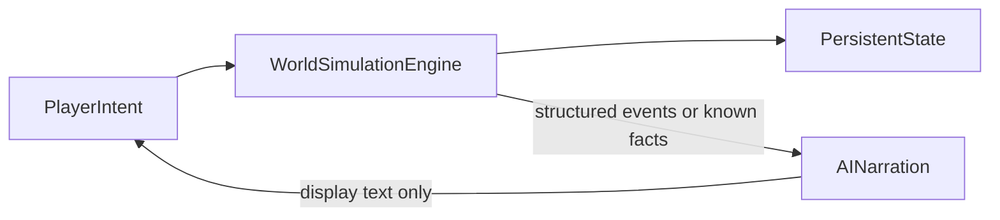

# AI Boundaries

## Purpose

Defines the authority split between the **world simulation engine** and AI. AI narrates; the engine decides and persists.

## Confirmed design

### Product role

- This is a **persistent cultivation world simulation**, not an AI that invents the rules as it goes.
- AI provides **narration**, **dialogue**, and **creative descriptions**.
- AI must **never** determine **numerical outcomes**.
- AI must **never** directly **modify saved state**.

### Engine is authoritative for

- Statistics
- Inventory
- Money
- Cultivation progress
- Breakthroughs
- Combat
- Time
- Permanent facts
- Technique encyclopedia records (once committed)
- World history and other durable simulation data

### Technique generation rule

- Techniques assisted or drafted by AI that are meant to exist in the world become **permanent world objects**.
- Commitment happens only through the **engine persistence path** (validate → assign id/metadata → write). AI text is never the database of record.

## Proposed details

### Interaction loop

1. Player expresses intent.
2. Engine validates, resolves, and commits state.
3. Engine emits structured events / known facts.
4. AI (when enabled) narrates.
5. Return to step 1.

If AI is unavailable, stub/template narration still works.

### Content proposal loop (techniques and similar)

1. AI or content pipeline proposes a technique (or other permanent object) draft.
2. Engine validates against schema, rarity/balance rules, and world constraints.
3. On acceptance, engine writes a permanent technique record (creator, history fields, grade, etc.—as available).
4. Narration may describe the discovery/invention **after** the record exists.

### Safe uses of AI

- Atmosphere for engine-known places
- Voice for NPCs with engine-owned goals and facts
- Describing outcomes the engine already decided
- Drafting candidate technique lore/metadata for engine review/commit

### Unsafe uses (forbidden)

- Inventing inventory, money, realm jumps, or combat victories as if real
- Declaring breakthrough success/failure
- Writing permanent facts into saves without engine commit
- Direct save-mutation tool access
- Treating uncommitted AI drafts as encyclopedia entries mid-play

### Defense in depth

- AI output is display-only unless a separate, explicit engine commit step runs.
- Engine state wins on conflict.
- Prompts under `prompts/` style text; they grant no authority.

### MVP relationship

- MVP playable loop does **not** require AI ([MVP_SCOPE.md](MVP_SCOPE.md)).
- Architecture must still assume later AI narration and AI-assisted technique drafts that become permanent via the engine.

## Out of scope / non-goals

- Model vendor selection in this document.
- Production prompt files in this pass.
- Full moderation policy (unresolved).

## Unresolved design questions

- Offline-capable forever vs modes that require AI?
- Model/hosting/cost/latency?
- Logging AI text for replay?
- How much NPC memory is engine-stored vs ephemeral context?
- Validation rules for AI-drafted techniques (auto-accept tiers vs review)?
- Streaming vs full responses?
- Content policy details aligned with tone toggles?

## Expansion notes

- Any future AI “tools” are read-only or proposal-only until the engine commits.
- Related documents: [GAME_PRINCIPLES.md](GAME_PRINCIPLES.md), [GAME_VISION.md](GAME_VISION.md), [CULTIVATION_SYSTEM.md](CULTIVATION_SYSTEM.md), [MVP_SCOPE.md](MVP_SCOPE.md).
