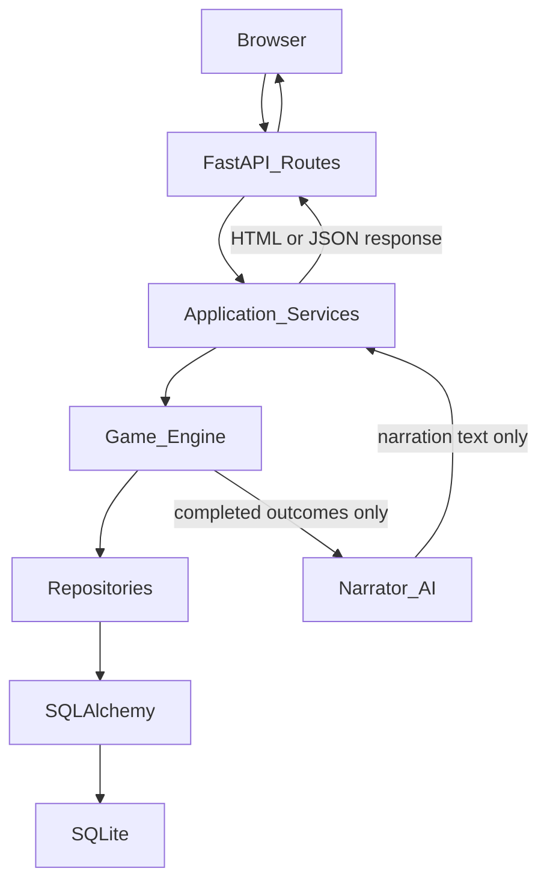

# Architecture

## Purpose

Defines the **runtime architecture** of the AI Cultivation RPG: request flow, layer responsibilities, AI placement, and future expansion points. Stack packages are locked in [TECH_STACK.md](TECH_STACK.md). Authority contract is locked in [AI_BOUNDARIES.md](AI_BOUNDARIES.md) and [GAME_PRINCIPLES.md](GAME_PRINCIPLES.md).

No application code is specified here—only structure.

---

## Confirmed design

### Request / simulation flow

```text
Browser
   ↓
FastAPI Routes
   ↓
Application Services
   ↓
Game Engine
   ↓
Repositories
   ↓
SQLAlchemy
   ↓
SQLite
```



### Authority

- The **Game Engine** is authoritative for all mechanics and durable facts.
- **AI narration receives completed engine outcomes.**
- **AI never modifies authoritative game state** (no direct repository/DB writes; no deciding combat, money, cultivation, inventory, relationships, or breakthroughs).
- Game mechanics must **function without AI** (stub/template Narrator).

---

## Layer responsibilities

### Browser

| Owns | Does not own |
|------|----------------|
| Rendering pages and UI interactions | Rules, calculations, persistence |
| Submitting player intents (forms, clicks, fetch) | Creating authoritative state |
| Displaying narration and engine-provided facts | Trusting AI text as mechanical truth |

Stack: HTML, CSS, vanilla JavaScript (see [TECH_STACK.md](TECH_STACK.md)).

### FastAPI Routes

| Owns | Does not own |
|------|----------------|
| HTTP endpoints, status codes, request parsing | Cultivation/combat math |
| Auth/session wiring (when added) | Direct SQLAlchemy session business rules |
| Returning Jinja2 HTML or JSON | Calling AI to “resolve” outcomes |
| Mapping HTTP ↔ application service calls | Bypassing services to mutate DB |

Thin adapters only.

### Application Services

| Owns | Does not own |
|------|----------------|
| Use-case orchestration (play turn, save, load, view character) | Core domain formulas living in the engine |
| Transaction boundaries (begin/commit via repos) | Raw SQL |
| Invoking engine with validated intents (Pydantic) | Inventing mechanical results |
| Asking Narrator for text **after** engine results exist | Letting Narrator write state |
| Assembling view models for templates/API | Mixing presentation into engine |

One service method ≈ one player-facing or system use case.

### Game Engine

| Owns | Does not own |
|------|----------------|
| Rules: cultivation, breakthroughs, tribulations, combat, time, economy | HTTP concerns |
| Calculations and outcome enums | HTML/CSS/JS |
| Emitting structured **completed outcomes** / events for narration | Calling Ollama/OpenAI directly (prefer Narrator port) |
| Enforcing Boundless/ordinary path rules, Heaven's Will hooks, etc. | Persisting rows (asks repositories) |
| Validating that intents are legal in current state | AI dialogue generation |

Pure domain logic, testable without FastAPI or a real AI provider.

### Repositories

| Owns | Does not own |
|------|----------------|
| Load/save aggregates and queries by ID | Business rules (“can this breakthrough succeed?”) |
| Mapping domain ↔ ORM models | HTTP |
| Hiding SQLAlchemy session details from the engine | Narration |

Permanent unique IDs for all important entities; never delete IDs ([`.cursor/rules/general-development.mdc`](../.cursor/rules/general-development.mdc), [DATABASE.md](DATABASE.md)).

### SQLAlchemy

| Owns | Does not own |
|------|----------------|
| ORM models, relationships, unit of work | Game rules |
| Typed access to tables | UI |

Use **SQLAlchemy 2**. Schema evolution via **Alembic**.

### SQLite

| Owns | Does not own |
|------|----------------|
| Durable bytes on disk | Application logic |
| Local single-player persistence for MVP | Multi-writer cloud assumptions |

### AI Narration (side path)

| Owns | Does not own |
|------|----------------|
| Turning **completed engine outcomes** + known facts into prose/dialogue | Combat, money, cultivation, inventory, relationships |
| Pluggable implementations behind an **Abstract Narrator** interface | Editing SQLite / repositories |
| Graceful degrade to stubs when offline | Overriding engine results |

Flow: Engine finishes → Services pass outcome DTO to Narrator → Narrator returns text → Response to browser.

---

## Cross-cutting concerns

| Concern | Home |
|---------|------|
| Config | pydantic-settings (injected into app/services) |
| Request/response validation | Pydantic models at route/service boundary |
| Migrations | Alembic against SQLite schema |
| Tests | pytest against engine + services; routes with TestClient as needed |
| Design truth | `docs/` (must stay synchronized with architecture changes) |

---

## Future expansion points

These attach **without** collapsing layers:

| Expansion | Where it plugs in |
|-----------|-------------------|
| Living sects / sect life ticks | Engine scheduling + services for “world tick”; repos for sect aggregates |
| Heaven's Will / tribulations | Engine modules; outcome events for Narrator |
| Technique encyclopedia at scale | Repos + indexed SQLite tables; engine effect bundles |
| Boundless story event | Application service orchestrates scripted beats; engine applies path commit |
| Local reputation graph | Engine + repos; never a global karma table as authority |
| Ollama / OpenAI-compatible APIs | New Narrator implementations only |
| Auctions, caravans, trade routes | Engine economy + repos; routes/services for UI |
| Procedural locations | Worldgen service → engine commit → repos |
| Optional later Docker / multiplayer | Outside MVP; would wrap same layering, not replace engine authority |
| Read-only admin/debug views | Routes + services querying repos; still no AI writes |

**Do not** add React/Vue/Angular/Node, Django/Flask, or Docker during MVP ([TECH_STACK.md](TECH_STACK.md)).

---

## Out of scope / non-goals

- Implementing packages or modules beyond the approved scaffold in ad-hoc PRs without docs sync
- Changing the locked stack

---

## Package layout (confirmed in scaffold)

```text
src/ai_adventure/
  api/           # FastAPI app factory + routes
  services/      # Application services
  engine/        # Game engine (authoritative rules)
  repositories/  # Persistence adapters
  db/            # SQLAlchemy Base, models, engine helpers
  data/          # Authored content (backgrounds, identity, story, npcs, sects)
  narration/     # Abstract Narrator + StubNarrator
  presentation/  # Jinja2 templates + static CSS/JS
  config.py
  main.py
alembic/         # Migrations
tests/
saves/           # SQLite DB path (default: saves/game.db)
```

**MVP defaults locked by scaffold:** sync SQLAlchemy; Jinja2 under `src/ai_adventure/presentation/`; SQLite default URL `sqlite:///…/saves/game.db` via pydantic-settings.

**Milestone 2 save model:** multiple save slots in one SQLite database; each `game_saves` row is a world-owned save (soft-delete; UUID ids). Active save remembered via cookie `active_save_id`. Backgrounds and personality questions are loaded from `data/` so content expands without engine code changes.

**Milestone 3 play model:** `/play/{save_id}` renders data-driven story scenes; `POST /play/{save_id}/action` submits story or cultivation intents through `GameAppService` → `engine/story.py` + `engine/cultivation.py` → repositories. Story position in `story_progress.current_node_id`.

---

## Unresolved design questions

1. Async SQLAlchemy later vs keep sync indefinitely?

---

## Expansion notes

- Related: [TECH_STACK.md](TECH_STACK.md), [AI_BOUNDARIES.md](AI_BOUNDARIES.md), [AI_SYSTEM.md](AI_SYSTEM.md), [DATABASE.md](DATABASE.md), [MVP_SCOPE.md](MVP_SCOPE.md), [DEVELOPMENT_ROADMAP.md](DEVELOPMENT_ROADMAP.md), [DECISIONS.md](DECISIONS.md).
