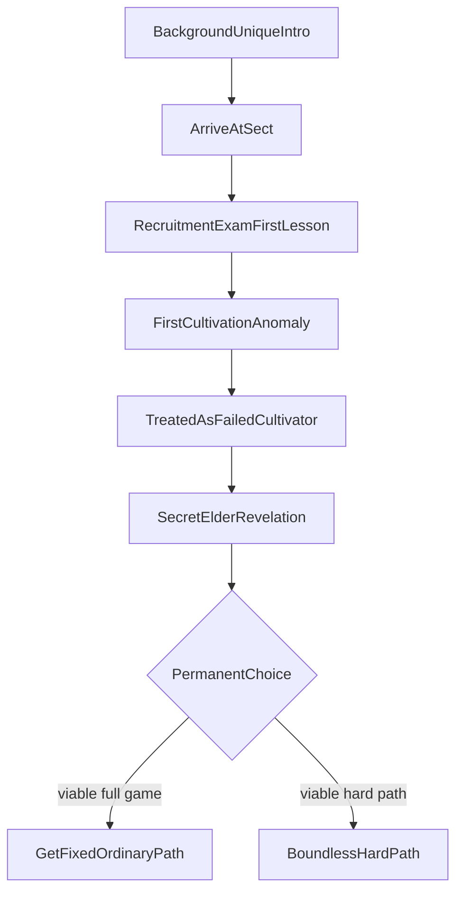

# Boundless Foundation Path

## Purpose

Defines the **Boundless Foundation Path** as a core narrative and cultivation choice: how it is introduced, what it means mechanically at a design level, and why it is permanent. Detailed power economics remain coordinated with [CULTIVATION_SYSTEM.md](CULTIVATION_SYSTEM.md).

---

## Confirmed design

### Availability

- The Boundless Foundation Path is a **permanent cultivation choice** available to **every player regardless of background**.
- It is **not** selected during character creation.
- It is introduced as a **mandatory story event** within approximately the **first 30 minutes** of gameplay.
- **Every player** experiences this event. Background changes **how** the player reaches the event, **not** whether the choice exists.
- The choice is **permanent and irreversible**.
- **Both options are fully viable end-to-end play styles.** Playing as a **normal (ordinary) cultivator** is a first-class path—not a consolation prize, trap, or soft-fail.
- The Boundless Foundation Path is **not objectively superior**. It is a **hard path**: a different philosophy that demands far greater time, resources, and perseverance for extraordinary long-term potential.
- Choosing ordinary means the anomaly is **resolved (“fixed”)** so the player can cultivate and breakthrough normally with peers.
- Before deciding, the player must **fully understand** benefits, drawbacks, and long-term consequences of **both** options (engine/UI copy and elder dialogue; AI may narrate but must not invent mechanical terms that contradict the engine).

### Naming note

This path replaces the earlier design name “Perfect Foundation Path.” All design docs should use **Boundless Foundation Path**.

### One ruleset

- Boundless vs ordinary is a **shared path type** in the cultivation systems (players and NPCs may both walk Boundless under the same math).
- The **mandatory first-30-minutes story framing** is how **players** discover and choose. NPCs do not need this exact intro quest, but they never receive softer Boundless rules than the player.
- No unique protagonist cultivation formulas—only this authored discovery beat and permanent commitment.

---

## Confirmed story flow

1. **Unique background introduction** — Every background has its own upbringing-based opening ([BACKGROUNDS.md](BACKGROUNDS.md)).
2. **Leave home → arrive at the sect** — Join the shared early pipeline.
3. **Initial recruitment**, **talent examination**, and **first cultivation lesson**.
4. **First true cultivation attempt** — Player builds qi via cultivation methods, reaches readiness, and **attempts breakthrough**. An **anomaly** occurs:
   - All indicators say breakthrough should happen.
   - **The breakthrough never happens** on that attempt.
5. **Investigation** — Instructors and examiners are confused; multiple checks fail to explain the stall; the player is a **mystery**, not a failed cultivator.
6. **Elder revelation** — Elder Yun Mei (M3) explains Boundless history and both paths privately.
7. **Permanent choice** (both viable):
   - **Option 1 — Get fixed / ordinary path:** Accept correction. The anomaly is resolved; the player proceeds as a **normal cultivator** with baseline costs, tribulations, and pacing. Sect “failed cultivator” stigma is cleared as the fix takes. This path is **designed to remain competitive and satisfying** for a full playthrough.
   - **Option 2 — Boundless Foundation Path (hard path):** **Abandon** the conventional cultivation path **forever** and walk Boundless—far greater time, resources, and perseverance for extraordinary long-term foundation and ceiling.

This event is one of the **defining moments** of the game. Neither option is the “correct” destiny.

---

## Confirmed design goals

| Goal | Requirement |
|------|-------------|
| Timing | Occurs naturally within ~**30 minutes** of gameplay |
| Universality | All backgrounds reach the same choice event |
| Agency | Informed, weighty, irreversible decision |
| Dual viability | **Ordinary (fixed) and Boundless are both supported full playthroughs** |
| Balance fantasy | Boundless = hard path, not free power; ordinary = standard viable pace |
| Clarity | Full disclosure of **both** options’ benefits, drawbacks, and long-term consequences before commit |

---

## Mechanical summary (confirmed direction)

| Aspect | Option 1 — Ordinary (after fix) | Option 2 — Boundless Foundation (hard path) |
|--------|----------------------------------|-----------------------------------------------|
| Status after choice | Anomaly **cleared**; can breakthrough normally | Conventional path **abandoned forever** |
| Breakthroughs | Baseline cultivation required | Far more cultivation required |
| Resources / time | Baseline | Greatly increased |
| Tribulations | Baseline signature set | Much harder |
| Foundations | Competent / variable | Trajectory toward near-flawless Foundation Quality |
| Power quality | Baseline body/qi/future breakthroughs | Stronger body, qi, future breakthroughs |
| Early game pacing | Keep pace with ordinary peers | Likely lag peers for a long time |
| High mastery | Strong within realm | May compete with ordinary cultivators **one major realm higher** |
| Design intent | **Fully viable** mainstream cultivation fantasy | **Fully viable** hardship / long-horizon fantasy |

“Compete with” remains conditional competence—not automatic victory in all circumstances ([CULTIVATION_SYSTEM.md](CULTIVATION_SYSTEM.md), [COMBAT.md](COMBAT.md)).

Content, sect advancement, professions, techniques, and endgame must be **reachable and rewarding on ordinary**—Boundless must not be required to “finish the game.”

---

## Proposed details

### Failed-cultivator interim

- Short social and mechanical soft-locks possible (mockery, revoked privileges, elders’ pity)—expressed via [REPUTATION.md](REPUTATION.md) and sect standing ([SECT_LIFE.md](SECT_LIFE.md)).
- Must not soft-lock the player out of the revelation scene.
- If **Option 1 (fix)** is taken, failed-cultivator stigma and soft-locks are **cleared** as part of the fix (timing/drama of the clearing is proposed, not unfinished punishment).

### Get fixed (Option 1) — proposed framing

- The revealer (or trusted method they teach) **corrects** the blocked breakthrough pattern so ordinary cultivation works.
- Engine sets path type to **ordinary** permanently for that run; breakthrough readiness behaves like any normal disciple.
- Player should feel relief and legitimacy—not shame for “refusing destiny.”

### Revealer archetype

- **Milestone 3 (locked):** Elder Yun Mei, Verdant Gate Foundation Hall elder — keeper of incomplete Boundless manuscripts ([OPENING_STORY.md](OPENING_STORY.md)).
- Long-term: other sects may use different revealers; same structural beat.

### Historical framing (Milestone 3)

The revelation must convey that Boundless Foundation was an **ancient, openly taught path** later **abandoned** for extreme cost and difficulty; surviving texts are **incomplete**; modern doctrine treats it as **obsolete or failed theory**. The player gambles on history's abandoned road—not a cheat code.

### Information package before choice (proposed checklist)

**If choosing Boundless (hard path):** time and resource hunger; harder tribulations; delayed early power vs peers; extraordinary long-term foundation and ceiling; irreversible abandonment of the conventional path.

**If choosing fix / ordinary:** anomaly will be corrected; breakthroughs will work normally; viable full career among peers; you forgo Boundless’s extreme late ceiling and near-flawless foundation trajectory; the decision is irreversible (cannot take Boundless later).

### MVP

- The anomaly → revelation → permanent choice is **in scope for the early playable story spine**, even if Boundless mechanical depth is still thin—architecture and outcomes must diverge after the choice ([MVP_SCOPE.md](MVP_SCOPE.md)).

---

## Out of scope / non-goals

- Choosing Boundless at character creation.
- Reversible dual-path hybrids after commit.
- Treating Boundless as the “correct” or destined option.
- Treating ordinary / “get fixed” as a weak or incomplete playthrough.
- Gating main content, sect career, or endgame behind Boundless.
- Unique Boundless combat math reserved only for the player.

---

## Unresolved design questions

1. Exact revealer casting and whether the player may refuse the private meeting once (soft delay) before hard-gating.
2. How the “fix” is depicted (rite, puncture of a seal, guided circulation, pill)—same mechanical result either way.
3. Whether Heaven's Will attention spikes at the anomaly for all, or only if Boundless is chosen ([HEAVENS_WILL.md](HEAVENS_WILL.md)).
4. Sect official doctrine vs secret knowledge—what of the event becomes rumor after a successful fix?
5. Can NPCs elsewhere already be Boundless walkers before the player (yes recommended for world depth)?

---

## Expansion notes

- Character creation must **not** include path selection ([CHARACTER_CREATION.md](CHARACTER_CREATION.md)).
- Related: [CULTIVATION_SYSTEM.md](CULTIVATION_SYSTEM.md), [BACKGROUNDS.md](BACKGROUNDS.md), [SECT_LIFE.md](SECT_LIFE.md), [PLAYER_IDENTITY.md](PLAYER_IDENTITY.md), [TRIBULATIONS.md](TRIBULATIONS.md), [MVP_SCOPE.md](MVP_SCOPE.md), [GAME_PRINCIPLES.md](GAME_PRINCIPLES.md).
