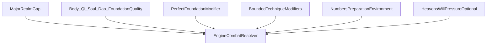

# Combat

## Purpose

Owns conflict resolution and how it respects realm scaling, multi-axis cultivation, Boundless Foundation Path, and engine authority—without exposing numeric combat power to players.

---

## Confirmed design

- Combat outcomes are **engine-authoritative**; AI never decides numerical results.
- Power scaling is **exponential** across major realms.
- Benchmark: ~**50 peak** of realm N to defeat **1 early** of realm N+1.
- Boundless Foundation high mastery may **compete with** ordinary early of N+1.
- **Same combat/cultivation-derived rules for players and NPCs**—no unique player combat math.
- Locked early realms (Body Tempering → Core Formation) are the early band set ([REALMS.md](REALMS.md)).
- Any **Combat Power Index (CPI)** or similar aggregate is **internal only**. The player must **never** see numerical combat power values.
- Player-facing signals: realm, stage, qualitative cues, injuries, Foundation Quality language, technique names, narration.
- Violence exists; serious xianxia tone; no excessive gore ([GAME_VISION.md](GAME_VISION.md)).
- MVP may omit or minimize combat; architecture anticipates a shared resolver.

---

## Proposed details

### Design compass (hidden math)

- Major-realm gaps dominate unless Boundless Foundation high-mastery exceptions or extreme preparation apply.
- 50:1 is a balance compass, not a literal raid requirement every time.
- Heaven's Will may bias environment or reinforcements—not a player-only curse ([HEAVENS_WILL.md](HEAVENS_WILL.md)).

### Presentation rules (confirmed intent)

| Allowed in UI / narration | Forbidden |
|---------------------------|-----------|
| “Early Foundation Establishment” | “CPI: 12840” |
| “Near-flawless foundations” | Raw combat power scores |
| “Your sword art edges the exchange” | Player-only damage formulas |

### Resolution tiers (proposed)

| Tier | Use |
|------|-----|
| Abstract contest | Quick duels / off-screen wars |
| Detailed encounter | Player-facing fights |
| Mass battle aggregation | Sect wars using same hidden compass |

### Techniques in combat (proposed)

Weapon, movement, body, soul, formation arts modify options within **bounded** effects; they do not erase major-realm gaps alone ([TECHNIQUES.md](TECHNIQUES.md)).

---

## Out of scope / non-goals

- Visible combat-power meters.
- Physics-accurate simulation.
- Gore spectacle systems.
- Unique protagonist hit-chance tables.

---

## Unresolved design questions

- Combat in MVP at all?
- Turn-based, opposed checks, or hybrid?
- Death permanence and injury model?
- How much Body vs Qi vs Soul weighting in hidden CPI?
- Sect war aggregation formulas?

---

## Expansion notes

- Related: [REALMS.md](REALMS.md), [CULTIVATION_SYSTEM.md](CULTIVATION_SYSTEM.md), [TRIBULATIONS.md](TRIBULATIONS.md), [HEAVENS_WILL.md](HEAVENS_WILL.md), [TECHNIQUES.md](TECHNIQUES.md).
