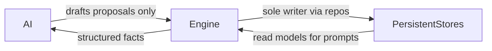

# Database

## Purpose

Owns persistence expectations for the world simulation: what must be stored, how saves scale, and how AI is kept out of direct writes.

## Confirmed design

- Everything important is **persistent**.
- The engine (via services/repositories) is the **only** writer of saved state; AI never modifies saves directly.
- **SQLite** + **SQLAlchemy 2** + **Alembic** ([TECH_STACK.md](TECH_STACK.md)).
- **One database file** holds **many** save worlds as rows. Each save eventually owns that run's entire persistent world ([DECISIONS.md](DECISIONS.md), [ARCHITECTURE.md](ARCHITECTURE.md)).
- Permanent **UUID** string ids for important entities; never reuse ids after soft-delete.
- **Schema evolves only via Alembic.** Production app startup does **not** call ``Base.metadata.create_all``. Isolated tests may use ``create_all`` deliberately (see `tests/conftest_helpers.py`).
- If a local ``saves/game.db`` was created by an older ``create_all`` path and lacks ``alembic_version`` history, reconcile only after verifying the live schema matches the stamped revision (do not stamp blindly).
- Migration ``0003_opening_story_cultivation`` is **idempotent** (skips existing columns/tables). Safe when SQLite non-transactional DDL left a partial apply without updating ``alembic_version``.
- **Root cause of historical drift:** app startup formerly called ``create_all``, creating M1/M2 tables without Alembic history. After ``stamp 0002``, ``upgrade`` of 0003 applied DDL; SQLite committed those ALTERs independently of ``alembic_version``. A later re-run then hit ``duplicate column name: world_day``. Production startup no longer creates schema; use ``alembic upgrade head``.

## Milestone 2 schema

| Table | Role |
|-------|------|
| `meta_records` | Scaffold key/value marker |
| `game_saves` | Save metadata: name, background, dates, location, playtime, `deleted_at` |
| `players` | Player for a save: money, cultivation seed columns, identity answers JSON, background history JSON |
| `inventory_items` | Starting / owned item stacks |
| `event_log` | Append-only events (`character_created`, …) |

Migrations: `0001_initial`, `0002_character_saves`, `0003_opening_story_cultivation`.

### Milestone 3 schema additions

| Table / column | Role |
|----------------|------|
| `story_progress` | Authoritative `current_node_id`, `flags_json` per save |
| `sect_membership` | Sect id + rank for the run |
| `npc_records` | Spawned authored NPC instances per save |
| `game_saves.world_day`, `story_started_at` | Minimal world clock + opening timestamp |
| `players.dao` | Fifth cultivation axis seed |
| `players.path_status` | `provisional`, `confirmed_ordinary`, `confirmed_boundless` |
| `players.qi_reserve_*`, `cultivation_progress`, `practice_sessions` | Opening cultivation loop |
| `players.anomaly_state`, `breakthrough_readiness`, `path_confirmed_at` | Anomaly + path commit |

See [OPENING_STORY.md](OPENING_STORY.md) for story-state semantics.

### Save metadata fields

- save id (UUID)
- character name
- background id + display name
- creation date
- last played date
- current location id/name
- playtime seconds
- soft-delete timestamp

### Expansion expectation

Later tables (NPCs, relationships, sects, cities, quests, world state, cultivation progress detail, reputation edges, etc.) attach with `save_id` foreign keys. Do not redesign around a single-player-only blob.

## AI interaction with storage

## Related

- [DECISIONS.md](DECISIONS.md), [ARCHITECTURE.md](ARCHITECTURE.md), [CHARACTER_CREATION.md](CHARACTER_CREATION.md), [TECH_STACK.md](TECH_STACK.md).
