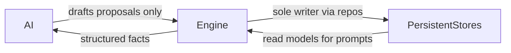

# Database

## Purpose

Owns persistence expectations for the world simulation: what must be stored, how saves scale, and how AI is kept out of direct writes.

## Confirmed design

- Everything important is **persistent**.
- The engine (via services/repositories) is the **only** writer of saved state; AI never modifies saves directly.
- **SQLite** + **SQLAlchemy 2** + **Alembic** ([TECH_STACK.md](TECH_STACK.md)).
- **One database file** holds **many** save worlds as rows. Each save eventually owns that run's entire persistent world ([DECISIONS.md](DECISIONS.md), [ARCHITECTURE.md](ARCHITECTURE.md)).
- Permanent **UUID** string ids for important entities; never reuse ids after soft-delete.

## Milestone 2 schema

| Table | Role |
|-------|------|
| `meta_records` | Scaffold key/value marker |
| `game_saves` | Save metadata: name, background, dates, location, playtime, `deleted_at` |
| `players` | Player for a save: money, cultivation seed columns, identity answers JSON, background history JSON |
| `inventory_items` | Starting / owned item stacks |
| `event_log` | Append-only events (`character_created`, …) |

Migrations: `0001_initial`, `0002_character_saves`.

### Save metadata fields

- save id (UUID)
- character name
- background id + display name
- creation date
- last played date
- current location id/name
- playtime seconds
- soft-delete timestamp

### Expansion expectation

Later tables (NPCs, relationships, sects, cities, quests, world state, cultivation progress detail, reputation edges, etc.) attach with `save_id` foreign keys. Do not redesign around a single-player-only blob.

## AI interaction with storage

## Related

- [DECISIONS.md](DECISIONS.md), [ARCHITECTURE.md](ARCHITECTURE.md), [CHARACTER_CREATION.md](CHARACTER_CREATION.md), [TECH_STACK.md](TECH_STACK.md).
