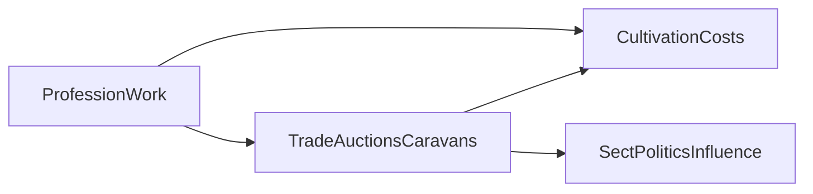

# Economy

## Purpose

Owns money, resources, markets, and long-term economic systems that fund cultivation and politics without replacing personal power.

## Confirmed design

- Profession earns **resources, reputation, money, influence, and knowledge** ([PROFESSIONS.md](PROFESSIONS.md)).
- **Reputation that affects prices is local** (settlement/faction/NPC opinion)—never a global good/evil meter ([REPUTATION.md](REPUTATION.md)).
- Engine is authoritative for **money** and inventory/resources.
- Long-term vision includes **dynamic economies**, **auctions**, **caravans**, and **trade routes** ([GAME_VISION.md](GAME_VISION.md)).
- Everything important is persistent—including wealth, debts, and market-relevant facts.
- **MVP implementation:** simple money/resource payouts and inventory.
- **Long-term architecture:** items, prices, routes, and auction records as data from day one.

## Proposed details

### Loops

### Currencies and goods (proposed)

| Kind | Role |
|------|------|
| Mundane coin | Early local trade |
| Spirit stones / equivalents | Cultivation-facing currency (names unresolved) |
| Materials | Crafting, breakthrough consumables |
| Reputation / influence | **Not global currency.** Prices and access use **local** opinion ([REPUTATION.md](REPUTATION.md)); influence is scoped political capital with a faction/office |

### Long-term systems (architecture)

- Dynamic pricing from supply, demand, and disruption
- Auctions for techniques, materials, beasts
- Caravans and trade routes as moving economic actors ([NPCS.md](NPCS.md), [WORLD_GENERATION.md](WORLD_GENERATION.md))

### MVP vs architecture

| MVP implementation | Long-term architecture |
|--------------------|------------------------|
| Flat prices / stub shop | Dynamic markets |
| Direct earn action | Jobs, contracts, caravan shares |
| No auctions | Auction houses tied to settlements/sects |

## Out of scope / non-goals

- Full ARPG loot tables in this pass.
- Real-money trading design.

## Unresolved design questions

- Dual-currency forever or unified later?
- Inflation controls across exponential cultivation eras?
- Player-run businesses vs NPC-only markets in early phases?
- How Boundless Foundation’s high costs reshape early scarcity?

## Expansion notes

- Economic events should write history when they matter (market collapses, embargoes).
- Related: [PROFESSIONS.md](PROFESSIONS.md), [SECTS.md](SECTS.md), [TECHNIQUES.md](TECHNIQUES.md), [DATABASE.md](DATABASE.md).
