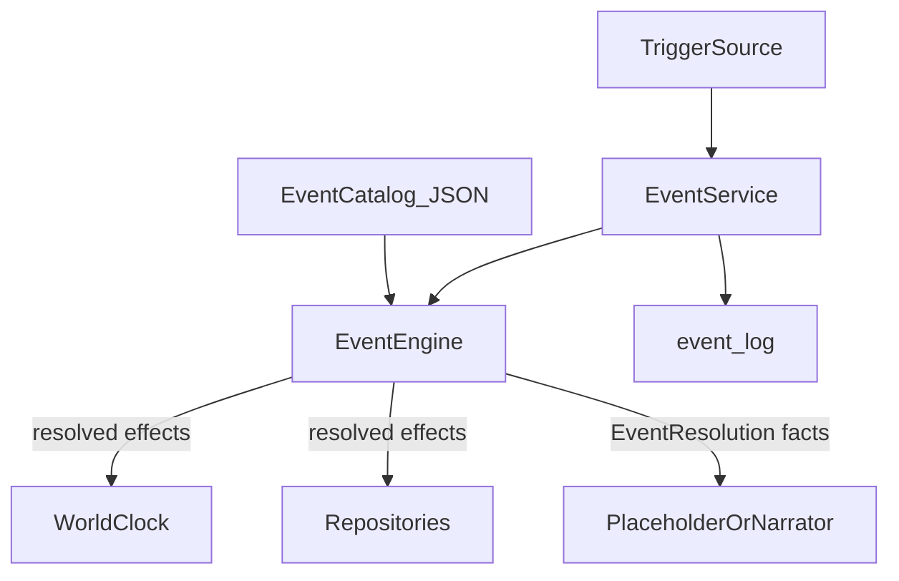

# Event Engine (Phase 4)

## Purpose

Defines the **reusable world event engine**: data-driven templates, deterministic resolution, persistence, and presentation hooks. This is the foundation for a dynamic world. AI may later narrate resolved events; AI never chooses eligibility, odds, rewards, or persistence.

**Status:** Phase 4a–4c implemented. Travel hook live in Location **5b**. Location-action triggers `after_explore` / `after_inspect` live in **5c**. AI narration not implemented.

### Developer tooling (Phase 4c prep)

| Tool | Entry |
|------|--------|
| Startup validation | `Settings.validate_event_catalog_on_startup` (default true) in `create_app` |
| Catalog audit | `engine/event_devtools.validate_event_catalog` — schema, duplicates, effect payloads, orphan files |
| Stats | `collect_event_stats` / CLI `stats` |
| Inspect / list | `inspect_event`, `list_event_summaries` |
| Simulation | `simulate_trigger` — dry-run, no persistence |
| CLI | `ai-adventure-events validate\|stats\|list\|inspect\|simulate` |
| Debug HTTP | `/debug/events/*` when `debug=True` |

Duplicate `event_id` across content files is an **error**. Duplicate `ai_prompt_key` is a **warning**. Unknown effect types / malformed payloads fail validation.


Related: [ARCHITECTURE.md](ARCHITECTURE.md), [AI_BOUNDARIES.md](AI_BOUNDARIES.md), [DATABASE.md](DATABASE.md), [DECISIONS.md](DECISIONS.md), [CULTIVATION_SYSTEM.md](CULTIVATION_SYSTEM.md).

---

## Confirmed principles (locked)

| Principle | Rule |
|-----------|------|
| Thin core first | Eligibility → roll → resolve effects → persist → emit outcome. No AI choice authority. |
| Actor refs | Internally use `actor_id` (opaque UUID string) so NPC migration stays straightforward. Phase 4 maps the player to a stable actor id without a full Actor table. |
| Centralized time | New systems advance time only via a minimal `WorldClock` / time service. Single world clock: `game_saves.world_day`. Playtime remains a separate **player telemetry** field, not a second simulation clock. |
| Data-driven | Event definitions live in JSON catalogs. Adding an event = data (+ tests), not engine branches per content id. |
| Engine authority | Backend owns eligibility, probabilities, rewards, penalties, persistence, world state. |
| AI presentation only | Placeholder text now; later Narrator renders completed `EventResolution` / `EngineOutcome` facts. |
| Stay playable | Ship incrementally; opening story + cultivation loop remain playable; tests pass after each milestone. |

### Deferred (hooks only)

- Partial breakthroughs, damaged foundations, unique tribulations
- Foundation Establishment playability
- Shared Actor cultivation model (roadmap Phase 9+; opaque `actor_id` already in use)
- Full AI narration / story arcs (roadmap Phase 12)
- Modifier Framework → Techniques → Spiritual Roots → Alchemy (roadmap Phases **6a–8**; see [MODIFIER_FRAMEWORK.md](MODIFIER_FRAMEWORK.md), [DEVELOPMENT_ROADMAP.md](DEVELOPMENT_ROADMAP.md))

**Note:** Event *mutations* (`modify_cultivation`, `grant_item`, …) stay in this engine. Declarative calculation biases belong to the Modifier Framework—do not merge the two.

### Phase 6d — Event Selection Bias (ModifierSnapshot consumer)

| Concern | Owner |
|---------|--------|
| Hard eligibility (realm, path, story flags, location ids, cooldown, max fires) | Event Engine — unchanged |
| Soft selection bias (effective weight, activation chance, optional capability flags) | Reads ephemeral `ModifierSnapshot` only |
| Mutations / persistence | Event Engine — never modifiers |

Generic bias types (not event-specific registry ids):

| Snapshot type | Event use |
|---------------|-----------|
| `weight_mult` | Effective weight = catalog `weight` × global mult × category mult |
| `chance_flat` | Activation chance = clamp(catalog `chance` + global flat + category flat, 0..1) |
| `flag` | Optional soft unlocks (`requirements.modifier_flags_all`) |

`category` on an effect spec matches `EventTemplate.category` (e.g. `cultivation`). Omitted category = global bias for that activity. Activity context: `world_event`.

Consumer allowlist: `EVENT_SUPPORTED_EFFECT_TYPES`. Unsupported snapshot keys are ignored.
---

## What an “event” is

An **event** is a discrete, engine-resolved world occurrence that may change persistent state and produce presentation text.

It is **not**:

- The append-only `event_log` audit trail (that remains a history log of many kinds of actions)
- An authored story **node** (Milestone 3 story graph stays authoritative for the opening spine)
- An AI-authored mechanic

**Story vs Event Engine:**

| System | Owns |
|--------|------|
| Story engine (`engine/story.py`) | Linear / branched authored beats; `story_progress.current_node_id` |
| Event engine (Phase 4) | Weighted / conditional world occurrences that can fire from triggers (post-session, travel, rest, explicit player action, later world ticks) |

Story actions may **enqueue or trigger** event-engine evaluations (e.g. “after cultivation session, roll ambient events”). Event results may set story flags or emit log entries, but do not replace `current_node_id` authority for the opening.

---

## Architecture

```text
Trigger (service / story / cultivation)
   ↓
EventService (application orchestration)
   ↓
EventEngine.evaluate(context)     # pure rules
   ↓
WorldClock.advance(...)           # only path for world_day deltas from events
   ↓
Repositories persist deltas
   ↓
EventLog + structured EngineOutcome
   ↓
Narrator / placeholder presentation text
```



### Package layout (proposed)

```text
src/ai_adventure/
  engine/
    time.py              # WorldClock port + impl over world_day
    actors.py            # ActorRef helpers (player → actor_id)
    events.py            # Catalog load, eligibility, resolve, DTOs
  data/events/
    event_manifest.json
    ambient_cultivation.json   # Phase 4 seed content
    ambient_exploration.json   # optional thin seed
  services/
    events.py            # EventService persistence orchestration
  db/models.py           # event_cooldowns / actor_registry (see schema)
```

Routes stay thin: existing play actions call services; optional later `POST .../events/resolve` only if needed for explicit player-facing rolls.

---

## Actor abstraction (Phase 4 minimal)

No full `actors` cultivation table yet.

| Concept | Phase 4 behavior |
|---------|------------------|
| `actor_id` | Stable UUID string identifying a simulation subject |
| Player | Each save’s player gets a durable `players.actor_id` (new column) = same as `players.id` **or** a dedicated column defaulting to `players.id` for migration clarity |
| NPCs | Existing `npc_records.id` is already a UUID; treat as `actor_id` when referenced |
| Event subjects | Templates may target `subject: "player"` (resolved to player actor_id) or explicit `actor_id` later |

**Recommendation:** Add `players.actor_id` (UUID, unique per save, NOT NULL, default = player row id on migration) so future shared Actor rows can point at the same id without rewriting event history.

Event instances always store `subject_actor_id` and optional `source_actor_id` (e.g. NPC who initiated an encounter).

---

## Time service (minimal)

```text
WorldClock
  - current_day(save) -> int
  - advance(save, days: int) -> int   # days >= 0; returns new day
```

Rules:

- **Only** `WorldClock.advance` (and legacy call sites gradually migrated) mutates `game_saves.world_day` for simulation.
- Event effects that cost time call `WorldClock`, never raw `save.world_day +=`.
- Phase 4 does **not** unify `playtime_seconds` into the world clock; playtime stays UX/telemetry.
- Cultivation sessions and story `increment_world_day` effects should be migrated to `WorldClock` in the same phase (small refactor, behavior unchanged).

---

## Data-driven catalog schema

### Manifest — `data/events/event_manifest.json`

```json
{
  "content_files": [
    "ambient_cultivation.json",
    "ambient_exploration.json"
  ]
}
```

### Event template (per file)

```json
{
  "schema_version": 1,
  "events": [
    {
      "id": "evt_quiet_meditation_insight",
      "category": "cultivation",
      "label": "Quiet Insight",
      "enabled": true,
      "weight": 10,
      "cooldown_days": 3,
      "max_fires_per_save": null,
      "trigger": {
        "kinds": ["after_cultivation_session"],
        "chance": 0.35
      },
      "requirements": {
        "path_status_in": ["confirmed_ordinary", "confirmed_boundless"],
        "min_realm_order": 1,
        "max_realm_order": 2,
        "flags_all": [],
        "flags_none": [],
        "location_ids": [],
        "min_world_day": 1
      },
      "context": {
        "location_tags": [],
        "weather_tags": [],
        "time_tags": [],
        "cultivation_tags": [],
        "npc_tags": [],
        "environment_tags": []
      },
      "effects": [
        {
          "type": "modify_cultivation",
          "payload": {
            "realm_comprehension_delta": 2,
            "cultivation_progress_delta": 0,
            "qi_reserve_delta": 0,
            "foundation_stability_delta": 0
          }
        },
        {
          "type": "advance_world_days",
          "payload": { "days": 0 }
        }
      ],
      "presentation": {
        "placeholder_text": "During practice, a fleeting insight settles into your bones.",
        "narration_keys": ["quiet_insight"]
      },
      "ai_prompt_key": null
    }
  ]
}
```

### Categories (extensible enum)

| category | Intended use |
|----------|----------------|
| `cultivation` | Practice side-effects, insights, minor setbacks |
| `exploration` | Travel / location discoveries |
| `npc_encounter` | Meeting or being approached (stub NPCs OK) |
| `discovery` | Finding items, clues, sites |
| `environment` | Weather, spiritual density, hazards |
| `combat` | Stub contests; full combat Phase 9 |
| `story` | Optional side beats that do not own `current_node_id` |

### Requirements (Phase 4 subset)

All evaluated by the engine against `EventContext`. Unknown requirement keys → validation error at catalog load (fail fast).

| Field | Meaning |
|-------|---------|
| `path_status_in` | Allowed path statuses |
| `min_realm_order` / `max_realm_order` | Against realm catalog `order_index` |
| `flags_all` / `flags_none` | Story flags |
| `location_ids` | Empty = any |
| `min_world_day` | Gate early spam |
| `subject_must_be_player` | Default true in Phase 4 |
| `modifier_flags_all` | Phase 6d: soft unlock — all listed snapshot flag ids must be present (empty = ignore) |

### Effects (Phase 4 allowlist)

| type | Payload | Notes |
|------|---------|--------|
| `modify_cultivation` | meter deltas (clamped) | Player subject only for now; applies via existing cultivation state helpers |
| `modify_money` | `copper_delta` | Can be negative if balance allows; engine rejects illegal states |
| `grant_item` | `item_code`, `display_name`, `quantity` | Uses inventory repo |
| `advance_world_days` | `days` | Via WorldClock |
| `set_flag` | `flag`, `value` | Story flags |
| `noop` | `{}` | Presentation-only event |
| `emit_log` | `event_type`, `payload` | Explicit audit (usually automatic) |

**Explicitly not in Phase 4:** combat resolution tables, technique grants, pill application, tribulation start, realm/stage advances (those stay in cultivation/breakthrough modules). Combat **category** events may use `noop` + placeholder text or tiny money/item stubs only.

### Trigger kinds (Phase 4)

| kind | When |
|------|------|
| `after_cultivation_session` | Successful session resolution (post-persist path in service) |
| `after_story_travel` | Story effect / action marked travel (optional thin hook) |
| `manual_debug` | Tests / future explicit “seek fortune” action |

World-tick triggers (`on_day_advance`) are **schema-reserved** but not required for the first playable milestone.

---

## Runtime DTOs (engine)

```text
ActorRef
  actor_id: str
  kind: "player" | "npc" | "unknown"

EventContext
  save_id: str
  subject: ActorRef
  world_day: int
  location_id: str
  story_flags: dict[str, bool]
  cultivation snapshot (player compatibility layer)
  trigger_kind: str
  rng: random.Random          # injectable; seeded from save RNG counter

EventTemplate                      # from catalog
EligibleEvent                      # template + computed weight
EventRoll
  fired: bool
  template_id: str | None
  roll: float
  chance: float

EventResolution                    # completed mechanical result
  instance_id: str                 # UUID for this firing
  template_id: str
  category: str
  subject_actor_id: str
  world_day_before: int
  world_day_after: int
  effects_applied: tuple[...]
  presentation_placeholder: str
  facts: dict[str, Any]            # narrator-safe structured facts
```

Resolution algorithm (deterministic given RNG):

1. Load enabled templates matching `trigger.kinds`.
2. Filter by hard requirements + cooldown + max_fires (+ optional `modifier_flags_all` against snapshot flags).
3. If none eligible → empty resolution (no-op).
4. Pick at most one event via weighted choice among eligible using **effective weights** (catalog weight × `ModifierSnapshot` `weight_mult` global + category).
5. Roll activation using **effective chance** (catalog chance + `chance_flat` global + category, clamped 0..1).
6. Apply effects in catalog order; clamp cultivation meters with existing helpers.
7. Record cooldown / fire count; append `event_log`; return `EventResolution`.

`modifiers=None` preserves Phase 4 behavior (weights/chances unchanged).

**Decision lean:** At most **one** world event per trigger invocation in Phase 4.

---

## Persistence schema

### Migration `0007_event_engine` (proposed)

| Change | Role |
|--------|------|
| `players.actor_id` | `String(36)`, NOT NULL, unique; backfill from `players.id` |
| `event_cooldowns` | Per-save cooldown / fire tracking |
| Optional: bump existing `cultivation_rng_counter` usage** or add `game_saves.world_rng_counter` | Shared RNG stream for events (prefer **save-level** counter so non-player events don’t sit on player row) |

#### `event_cooldowns`

| Column | Type | Notes |
|--------|------|--------|
| `id` | UUID PK | EntityMixin |
| `save_id` | FK | |
| `event_template_id` | str | Catalog id |
| `subject_actor_id` | str | Actor who fired / was subject |
| `last_fired_world_day` | int | |
| `fire_count` | int | Default 0 |
| unique | `(save_id, event_template_id, subject_actor_id)` | |

Resolved event details continue to use existing **`event_log`** (`event_type` e.g. `world_event_resolved`, payload = resolution facts JSON). Avoid a second history table in Phase 4.

### RNG separation (why two counters)

| Counter | Owner | Used by |
|---------|--------|---------|
| `players.cultivation_rng_counter` | Player row | Cultivation sessions / breakthroughs |
| `game_saves.world_rng_counter` | Save row | World event engine |

They stay separate so adding events does not shift cultivation roll sequences for existing saves/tests. Long-term a single save-level stream may be unified; do not merge in Phase 4. Event evaluation **always** takes an injected `random.Random` — never `random.random()` module globals.

### Persistence schema

#### Migration `0007_event_engine` (Phase 4a)

| Change | Role |
|--------|------|
| `players.actor_id` | Opaque UUID; backfill from `players.id`; unique index |
| `event_cooldowns` | Current cooldown / fire count only |
| `game_saves.world_rng_counter` | Event RNG stream |

#### Repeatable vs one-time

| Field | Semantics |
|-------|-----------|
| `max_fires_per_save: null` | Repeatable (cooldown permitting) |
| `max_fires_per_save: 1` | One-time per save/subject |
| `max_fires_per_save: N` | At most N fires |
| `cooldown_days: 0` | No day gate between fires |
| `cooldown_days: N` | Eligible again when `world_day >= last_fired + N` |

#### `event_cooldowns`

| Column | Type | Notes |
|--------|------|--------|
| `id` | UUID PK | EntityMixin |
| `save_id` | FK | |
| `event_template_id` | str | Catalog id |
| `subject_actor_id` | str | Opaque actor id |
| `last_fired_world_day` | int | |
| `fire_count` | int | Default 0 |
| unique | `(save_id, event_template_id, subject_actor_id)` | |

Resolved event details use immutable **`event_log`** (`event_type` = `world_event_resolved`, payload includes template id + mechanical effects). Placeholder narration in the payload is explicitly non-authoritative.

### Service API (proposed)

```text
EventService.evaluate_trigger(
    save_id,
    trigger_kind,
    *,
    subject_actor_id: str | None = None,  # default player.actor_id
) -> EventTriggerBatch
```

Wiring (incremental):

1. **Milestone 4a (done):** Catalog + engine pure functions + WorldClock + actor_id migration + cooldown repo + unit tests (no UI, no live hook).
2. **Milestone 4b (done):** `EventService` + persist cooldowns/log; hook `after_cultivation_session` after successful session (same transaction); small seed set.
3. **Milestone 4c (done):** Developer tooling (validate/inspect/simulate/stats) + expanded event library.
4. **Milestone 5b:** Travel trigger; migrate remaining `world_day` writes through WorldClock (formerly planned as 4d).

Opening story remains playable at every milestone.

---

## Presentation

Phase 4:

- Use `presentation.placeholder_text` from the template (and optional effect summary line from engine facts).
- Pass `EventResolution.facts` into existing `EngineOutcome` / play `message` channel.
- Do **not** call external AI.

Later:

- Narrator receives facts only; may replace placeholder prose; must not alter rewards.

---

## Testing strategy

| Layer | Tests |
|-------|--------|
| Catalog validation | Bad JSON / unknown effect types fail load |
| Eligibility | Flags, realm order, cooldown, path_status |
| RNG | Injected `Random`; same seed → same resolution |
| Effects | Meter clamps, money, item grant, WorldClock advance |
| Integration | After session → at most one event; cooldown respected |
| Regression | Existing opening story + cultivation + breakthrough tests still pass |

---

## Non-goals (Phase 4)

- AI-generated event text or choices that change odds/rewards
- Full quest graph replacing story engine
- Off-screen world simulation ticks
- Shared Actor cultivation schema
- Combat math beyond placeholder category
- Unlocking Foundation Establishment

---

## Open points for approval

1. **One event per trigger** (weighted pick + chance) — confirm?
2. **`players.actor_id` backfill = `players.id`** — confirm?
3. **Separate `world_rng_counter` on `game_saves`** vs reuse cultivation counter — recommend separate; confirm?
4. **First live travel hook** lands in Location Phase **5b** (with WorldClock unification) — confirm?
5. **Seed content volume** — propose 3 cultivation ambient + 1 exploration noop/discovery stub — enough?

---

## Expansion notes

After approval, implement milestones 4a→4c then Location 5a→5c (done); next is Modifier Framework **6a–6b** then Techniques **6c**. Keep event *mutations* separate from [MODIFIER_FRAMEWORK.md](MODIFIER_FRAMEWORK.md). Update [DECISIONS.md](DECISIONS.md), [DATABASE.md](DATABASE.md), [DEVELOPMENT_ROADMAP.md](DEVELOPMENT_ROADMAP.md), [LOCATIONS.md](LOCATIONS.md), and [ARCHITECTURE.md](ARCHITECTURE.md) in the same PRs as code.
