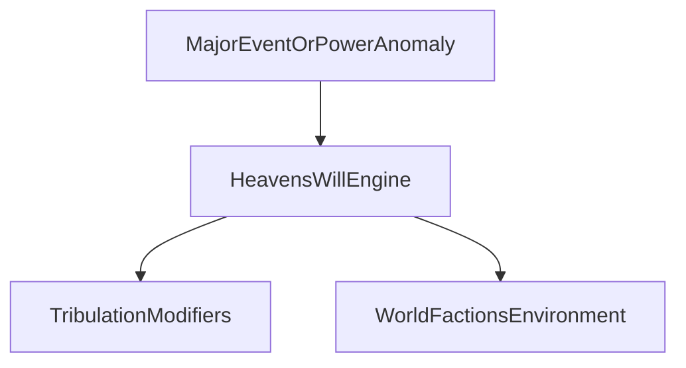

# Heaven's Will

## Purpose

Defines the world balancing system (**Heaven's Will**): how the simulation reacts to major events and powerful cultivators so the world stays coherent, dangerous, and alive—without unique player-only laws.

---

## Confirmed design

- The world includes a balancing system called **Heaven's Will** that **naturally reacts** to:
  - **Major events**
  - **Powerful cultivators**
- Reactions are **engine-simulated** permanent/temporary world pressures—not AI whim.
- Applies through the **same rules** to player and NPC cultivators. The player is not exempt as “the protagonist.”
- Interacts with signature tribulations (especially heavenly and heart-demon weight) ([TRIBULATIONS.md](TRIBULATIONS.md)).
- Serves long-term consistency over short-term spectacle ([GAME_PRINCIPLES.md](GAME_PRINCIPLES.md)).
- **MVP:** may be a thin attention meter or stub hooks; **architecture** must include Heaven's Will from day one as a first-class system.

---

## Proposed details

### What Heaven's Will is (and is not)

| Is | Is not |
|----|--------|
| A simulation layer that tracks disruption and power pressure | A chatty narrator personality (AI may describe outcomes) |
| Source of world reactions (hunts, omens, tribulation severity, faction alerts) | An excuse for unique player cultivation math |
| Applicable to any actor who warps fate/power curves | Guaranteed antagonism every session |

### Attention / pressure (proposed)

Engine tracks **attention** (name tunable) on actors, regions, or events:

- Spikes: rapid breakthroughs, mass slaughter, defying sealed laws, Boundless Foundation peak anomalies, opening forbidden realms.
- Decays: obscurity, sealed cultivation, time, world stabilization.

High attention proposed effects (examples, not locked): harder or earlier heavenly tribulations; rival/sect notice; beast tides; resource heaven-earth imbalance; bounty-like pursuit; rare **unique tribulation** eligibility.

### Major event reactions (proposed classes)

| Event class | Example reactions |
|-------------|-------------------|
| Power anomaly | Tribulation severity ↑; monitors from sects/immortals |
| Political catastrophe | Region instability; caravan failure; war flags |
| Inheritance rupture | Contenders drawn; Heaven's Will “correction” storms |
| Dao blasphemy / law break | Heart demon weight ↑; Dao trial forced |

### Presentation

- Players see omens, rumors, environmental change, NPC behavior—not a “Heaven's Will score: 87” requirement. Internal scores may exist; avoid making the fantasy feel like a threat meter HUD unless later design explicitly wants a subtle omen UI.

### MVP vs architecture

| MVP | Long-term |
|-----|-----------|
| Optional stub flag on powerful breakthroughs | Full attention model + regional fields |
| Same API for player/NPC | Faction and immortal sensors |
| Few reaction types | Rich reaction table + history |

---

## Tradeoff summary

1. **Universal attention rules** over protagonist immunity → living world.  
2. **Engine reactions** over pure narrative coincidence → persistable balance.  
3. **Qualitative player cues** over raw meter fetish → tone fit (similar to hidden CPI policy).

---

## Out of scope / non-goals

- Omnipotent always-punish players for succeeding (balance = reaction, not spite).
- Replacing sect politics or economy—Heaven's Will **pressures** those systems.
- Implementation code.

---

## Unresolved design questions

1. Is Heaven's Will one global field, per-world, or per-region?
2. Can treasures/formations mask attention (item effects under shared rules)?
3. Immortal-layer beings as agents of Heaven's Will vs abstract force?
4. Player-visible omen strength vs fully hidden?
5. Interaction with Boundless Foundation—always higher baseline attention?

---

## Expansion notes

- Related: [WORLD_MODEL.md](WORLD_MODEL.md), [TRIBULATIONS.md](TRIBULATIONS.md), [CULTIVATION_SYSTEM.md](CULTIVATION_SYSTEM.md), [SECTS.md](SECTS.md), [NPCS.md](NPCS.md), [GAME_VISION.md](GAME_VISION.md).
