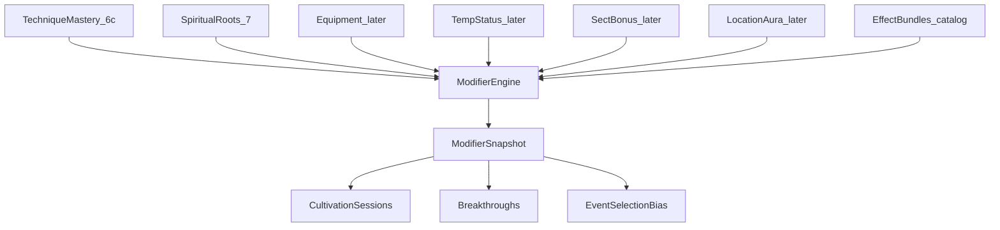

# Modifier Framework (Phase 6a)

## Purpose

Defines the **thin, engine-owned Modifier Framework**: a deterministic aggregation layer that answers one question only:

> **What mechanical influences apply to this actor right now?**

It is **not** an ability system, scripting engine, gameplay runtime, or state-mutation pipeline.

**Status:** Phase **6a–6d** shipped. Consumers: sessions, breakthroughs, event selection bias. **Phase 7** Spiritual Roots = second modifier source (same allowlisted types). Boundless remains outside modifiers. Next optional consumer: combat.

Related: [ARCHITECTURE.md](ARCHITECTURE.md), [TECHNIQUES.md](TECHNIQUES.md), [CULTIVATION_SYSTEM.md](CULTIVATION_SYSTEM.md), [EVENT_ENGINE.md](EVENT_ENGINE.md), [DECISIONS.md](DECISIONS.md), [DEVELOPMENT_ROADMAP.md](DEVELOPMENT_ROADMAP.md), [AI_BOUNDARIES.md](AI_BOUNDARIES.md).

---

## Confirmed principles (locked)

| Principle | Rule |
|-----------|------|
| Single question | Framework only computes mechanical influences for an actor in a context |
| Engine-owned | Aggregation, validation, caps, context filtering, stacking, and snapshots are engine code |
| Content supplies data only | Catalogs fill parameters into allowlisted types; content never defines new mechanics |
| Fail fast | Unknown effect types fail catalog validation |
| Deterministic | Same inputs → same `ModifierSnapshot`; no AI, no wall-clock, no hidden globals |
| Explainable | Every resolved value has an audit trail of contributing sources |
| Ephemeral snapshot | `ModifierSnapshot` is **never** persisted; always recomputed from active sources |
| Boundless stays out | Path multipliers remain in cultivation helpers until a later cleanup (not Phase 6) |

---

## Three concepts that must never merge

These responsibilities stay separate forever:

| Concept | Meaning | Examples |
|---------|---------|----------|
| **Intent** | What the actor attempts | Cultivate session, travel, explore, breakthrough attempt |
| **Modifier** | What biases the calculation | Session progress mult, breakthrough chance flat, capability flags |
| **Mutation** | What permanently changes state | Event `modify_cultivation`, story `set_flag`, grant item, advance world day |

```text
Intent (service / action)
   ↓
Consumers ask ModifierEngine for Snapshot   ← modifiers (this framework)
   ↓
Rules compute outcome using Snapshot
   ↓
Mutations apply via existing effect pipelines  ← events / story / cultivation apply paths
   ↓
Persistence
```

**Do not** fold Event Engine or story effect *application* into the Modifier Framework.  
**Do not** turn location actions / travel / cultivate into “abilities” inside this module.

---

## Architecture

```text
Sources (data + save state)
   → EffectInstance[]
   → ModifierEngine.aggregate(context)
   → ModifierSnapshot (ephemeral)
   → Consumers (sessions, breakthroughs, later combat / events)
```



### Layer ownership

| Layer | Owns |
|-------|------|
| Effect type registry (`data/modifiers/effect_types.json`) | Per-type: value type, aggregation rule, engine caps, allowed contexts |
| Effect bundles (content catalog) | Reusable parametric effect packs |
| Sources (adapters) | Resolve mastery / gear / status → `EffectInstance`s |
| ModifierEngine | Validate, filter by context, aggregate, clamp, audit |
| Consumers | Read snapshot only; never read technique tables for math |
| Saves | Mutable source state only (mastery, equipped, expirations) — **not** snapshots |
| AI | Never; may later draft bundle params into known types via engine commit |

---

## Core types (contract)

```text
EffectTypeId          # allowlisted string

EffectTypeDefinition  # registry row — single source of truth for interpretation
  id: EffectTypeId
  value_type: "number" | "boolean"
  aggregation: "sum" | "multiply" | "or"
  param_key: "flat" | "mult" | "flag"
  identity: number | bool     # start value before contributions
  cap_min / cap_max: number | null   # engine-owned; null = no bound
  allowed_contexts: list[str]        # only contexts this type may ever apply to

ModifierSourceKind =
  technique_mastery
  | spiritual_root       # Phase 7+
  | equipment
  | artifact
  | temporary_status     # buff / debuff / blessing / curse
  | sect_bonus
  | location_aura
  | cultivation_path    # reserved; Boundless NOT wired in Phase 6
  | …

EffectSpec
  type: EffectTypeId
  params: { flat?: number, mult?: number, flag?: string }  # keyed by type.param_key
  applies_to: list[str]   # required; each entry must be ⊆ type.allowed_contexts
  category: str | null    # optional contextual bucket (e.g. event category); null = global

EffectBundle
  id: str
  schema_version: int
  effects: list[EffectSpec]

EffectInstance
  source_kind: ModifierSourceKind
  source_id: str
  actor_id: str
  bundle_id: str | null
  inline_effects: list[EffectSpec] | null   # prefer bundles; inline for tests/fixtures
  expires_world_day: int | null             # null = permanent
  magnitude_scale: float                    # default 1.0 (mastery / quality)

ModifierContext
  actor_id: str
  world_day: int
  activity: str           # cultivate_session | breakthrough | world_event | travel | combat | …

ModifierSnapshot          # immutable, ephemeral
  numbers: mapping EffectTypeId → float              # uncategorized (category null) numerics
  categorized_numbers: mapping EffectTypeId → (category → float)
  flags: frozenset[str]                              # granted flag ids (type `flag`)
  contributions: audit list
    (source_kind, source_id, effect_type, detail, raw, applied, category?)
```

### Generic bias types + category metadata (Phase 6d — locked)

Prefer **reusable bias types** over system-specific type ids when the math is the same shape:

| Type | value_type | aggregation | Role |
|------|------------|-------------|------|
| `weight_mult` | number | multiply | Biases weighted selection |
| `chance_flat` | number | sum | Biases an activation / success chance |
| `flag` | boolean | or | Capability / soft-unlock flags |

**Contextual metadata** (not new types) scopes a contribution:

| Field | Role |
|-------|------|
| `applies_to` | Activity filter (`world_event`, later `combat`, …) |
| `category` | Optional bucket string (e.g. event `cultivation` / `discovery`); omit for global bias |

Example bundle effect (canonical shape — params still use registry `param_key`, not a free `value` field):

```json
{
  "type": "weight_mult",
  "params": { "mult": 1.15 },
  "applies_to": ["world_event"],
  "category": "cultivation"
}
```

Aggregation buckets by `(effect_type_id, category)`. Consumers request a type + optional category (and compose global + category when needed). **Do not** invent `event_weight_mult` / `event_activation_chance_flat` — Events ask for `weight_mult` / `chance_flat` under activity `world_event`.

Domain-specific types (`session_progress_mult`, `breakthrough_chance_flat`, …) remain valid where the formula is unique to that subsystem.

### Effect type registry (locked)

Interpretation of every effect type lives in `data/modifiers/effect_types.json`, not in consumers.

Each type **must** declare:

| Field | Role |
|-------|------|
| `value_type` | `number` or `boolean` |
| `aggregation` | `sum`, `multiply`, or `or` |
| `cap_min` / `cap_max` | Engine caps (null = unbounded on that side) |
| `allowed_contexts` | Contexts this type may appear in |

Bundles / inline specs may only use registered types. `applies_to` entries must be a subset of `allowed_contexts`. Unknown types or mismatched params fail validation.

Consumers must not invent alternate stacking or caps for a type.

### Aggregation API

```text
aggregate(
  instances: Sequence[EffectInstance],
  context: ModifierContext,
  *,
  type_registry: EffectTypeRegistry,
  bundles: EffectBundleCatalog,
) -> ModifierSnapshot
```

Pure function. No database I/O. Injectable catalogs for tests.

---

## Aggregation algorithm (Phase 6 — locked simple)

Per **effect type**, using that type’s registry `aggregation` rule (not consumer logic):

| Aggregation | Behavior |
|-------------|----------|
| `sum` | Start at `identity` (0); add each scaled flat; clamp to caps |
| `multiply` | Start at `identity` (1); multiply each scaled mult; clamp to caps |
| `or` | Collect flag ids; any contribution grants that flag |

Scaling (`magnitude_scale`):

- flat: `flat * magnitude_scale`
- mult: `1 + (mult - 1) * magnitude_scale`
- flag: grant when `magnitude_scale > 0`

Filters before aggregation:

1. `instance.actor_id == context.actor_id`
2. Not expired: `expires_world_day` is null or `world_day < expires_world_day`
3. `context.activity` ∈ effect `applies_to`

Numeric aggregation is **bucketed by** `(effect_type_id, category)` where omitted/`null` category is the global bucket. Caps apply per bucket after aggregation.

### Explicitly forbidden in Phase 6

- Diminishing returns
- Priority / ordering between sources
- Exclusive groups / overwrite rules
- Scripting or per-content custom stacking
- Content-authored cap overrides (caps live only on the type registry)

Richer stacking appears only when a real gameplay requirement forces an **engine version** change.

---

## Phase 6 starter effect-type allowlist (locked in 6b)

| Type | value_type | aggregation | Caps | allowed_contexts |
|------|------------|-------------|------|------------------|
| `session_progress_mult` | number | multiply | max 1.25 | `cultivate_session` |
| `session_qi_gain_mult` | number | multiply | max 1.25 | `cultivate_session` |
| `session_stability_flat` | number | sum | ±5 | `cultivate_session` |
| `comprehension_gain_mult` | number | multiply | max 1.25 | `cultivate_session` |
| `breakthrough_chance_flat` | number | sum | ±0.05 | `breakthrough` |
| `weight_mult` | number | multiply | max 1.25 | `world_event` (expandable later) |
| `chance_flat` | number | sum | ±0.05 | `world_event` (expandable later) |
| `flag` | boolean | or | — | `cultivate_session`, `breakthrough`, `world_event`, `travel`, `combat` |

Hard balance rules:

- No effect (alone or stacked within caps) may approximate **+1 major realm**
- Caps are engine-owned via the type registry
- Unknown types → catalog validation error

Activity context strings (starter set):

| Activity | Typical consumers |
|----------|-------------------|
| `cultivate_session` | Active cultivation sessions |
| `breakthrough` | Breakthrough chance / readiness consumers |
| `world_event` | Event selection bias (weights + activation chance) |
| `travel` | Reserved |
| `combat` | Reserved (Phase 10+) |

Effects whose `applies_to` does not include `context.activity` are ignored for that aggregation call (not an error).

---

## Consumer ownership (locked)

Each **consumer** of `ModifierSnapshot` must declare an explicit allowlist of effect types it understands.

| Consumer | Module constant | Supported types | Status |
|----------|-----------------|-----------------|--------|
| Cultivation sessions | `SESSION_SUPPORTED_EFFECT_TYPES` | `session_progress_mult`, `session_qi_gain_mult`, `session_stability_flat`, `comprehension_gain_mult` | Shipped |
| Breakthroughs | `BREAKTHROUGH_SUPPORTED_EFFECT_TYPES` | `breakthrough_chance_flat` | Shipped |
| Event selection bias | `EVENT_SUPPORTED_EFFECT_TYPES` | `weight_mult`, `chance_flat` (+ `flag` for soft unlocks) | Shipped |
| Combat | — | TBD | Not wired |

**Event selection bias (Phase 6d):** Hard eligibility, cooldowns, requirements, mutations, and persistence stay in the Event Engine. The Modifier Framework only supplies soft bias. See [EVENT_ENGINE.md](EVENT_ENGINE.md).

**Policy:** unsupported effect types present on a snapshot are **ignored** (never interpreted). Consumers read only via `consumer_number(..., supported=...)`. Accidental use of foreign keys is forbidden.

Registry `allowed_contexts` still gates which activities a type may appear in; consumer allowlists gate which types a subsystem applies.

Consumers **must not** inspect technique catalogs, mastery tables, or effect bundles. They receive an ephemeral `ModifierSnapshot` only.

---

## Techniques as first source (Phase 6c)

| Piece | Role |
|-------|------|
| Technique catalog | Identity, requirements, lore, `effect_bundle_id` |
| Actor mastery (save) | Known / progress / mastery rank / equipped |
| Effect bundles | Shared parametric effects |
| Source adapter | Equipped (and policy-allowed known) techniques → `EffectInstance`s |
| Consumers | Cultivation sessions + breakthroughs (via snapshots) |

Later sources (Spiritual Roots, Equipment, Artifacts, temporary statuses, Sect Bonuses, Location Auras) **must** emit the same allowlisted effect types. They must not invent private math channels into consumers.

---

## Persistence rules

| Persist? | What |
|----------|------|
| Yes (content) | Effect type registry metadata, effect bundles, technique definitions |
| Yes (save) | Mastery, equipped slots, temporary statuses, expiration days |
| **Never** | `ModifierSnapshot` |

Same pattern as locations: catalog authority for what exists; saves hold mutable state only.

**Phase 6a:** documentation only — no Alembic migration.  
**Phase 6b:** engine module + tests — still no save schema required if sources are empty/fixtures.  
**Phase 6c:** mastery / technique save tables as needed.

---

## Relationship to Event Engine mutations

| System | Owns |
|--------|------|
| Modifier Framework | Declarative influence on *upcoming* calculations |
| Event Engine effects | Imperative mutations when an event resolves (`modify_cultivation`, `grant_item`, …) |
| Story effects | Imperative story/state transitions |

An event may *grant* a temporary status (mutation → new source). That status later contributes modifiers. The event payload itself is not a modifier.

---

## Boundless / path multipliers (explicit exclusion)

Ordinary vs Boundless progress, resource, and breakthrough threshold multipliers remain in cultivation path helpers ([CULTIVATION_SYSTEM.md](CULTIVATION_SYSTEM.md), `engine` path constants).

- Source kind `cultivation_path` is **reserved** only
- Do **not** migrate Boundless into the Modifier Framework in Phase 6
- Revisit after multiple real sources exist and opening-story regressions are low-risk

---

## Milestone plan

| Phase | Scope | Code? |
|------:|--------|-------|
| **6a** | This design lock; roadmap/decision/doc cleanup | Docs only |
| **6b** | `engine/modifiers.py`, type/bundle registries, validation, `aggregate()` + unit tests; **no gameplay change** | Shipped |
| **6c** | Technique catalog + mastery + starters; sessions + breakthroughs as consumers | Shipped |
| **6d** | Event Selection Bias consumer — generic `weight_mult` / `chance_flat` + category; proving technique/event | Shipped |
| **7** | Spiritual Roots — second modifier source; ownership + bundles → snapshot | Shipped |
| **8** | Alchemy — third modifier source; ownership + bundles → snapshot (no new calculation system) | Shipped |

Stop after Phase 8 for review before the next major system.

---

## Non-goals (Phase 6a–6b)

- Technique content or mastery UI
- Equipment, roots, blessings, location aura wiring
- Combat resolution via modifiers
- Moving Boundless into modifiers
- Unifying intents into an ability runtime
- Persisting snapshots
- AI involvement of any kind

---

## Testing expectations (Phase 6b+)

| Layer | Tests |
|-------|--------|
| Catalog validation | Unknown types, bad params, missing `applies_to` fail load |
| Aggregation | Same instances + context → same snapshot |
| Stacking | Flats sum; mults multiply; caps clamp; flags OR |
| Context filter | Effects for other activities do not apply |
| Expiration | Expired instances excluded by `world_day` |
| Audit | Contributions list explains each resolved value |
| Regression | Existing cultivation / story / event / location tests still pass (6b must not change gameplay) |

---

## Expansion notes

- Update [DECISIONS.md](DECISIONS.md) when 6b/6c ship.
- Technique encyclopedia queries remain in [TECHNIQUES.md](TECHNIQUES.md); this doc owns mechanical influence aggregation only.
- CPI-adjacent combat modifiers (later) use the same allowlist + caps discipline; never expose CPI to players.
