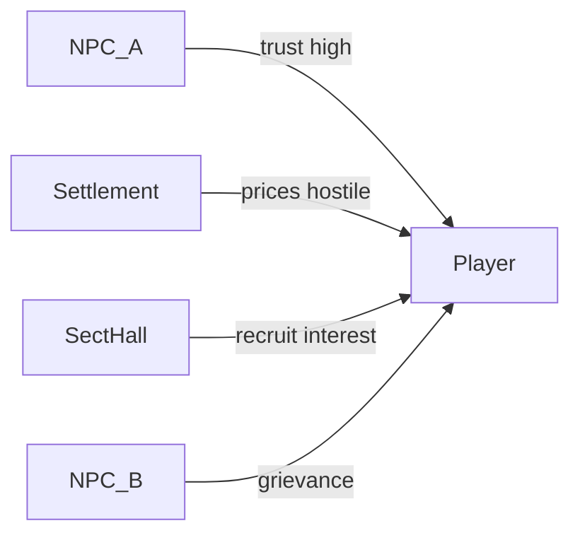

# Reputation

## Purpose

Defines reputation as **local, relational opinion**—not a global morality meter—and how it shapes dialogue, prices, recruitment, and opportunities.

---

## Confirmed design

- **Reputation is local rather than global.**
- **Every NPC, faction, and settlement should maintain independent opinions** of relevant actors (including the player and other NPCs).
- **No global good/evil meter.**
- Reputation should influence:
  - **Dialogue**
  - **Prices**
  - **Recruitment**
  - **Opportunities**
- Engine owns reputation values/facts; AI uses them for tone, never invents durable standing.
- Same reputation systems apply to NPC-NPC opinions, not player-only.
- Profession and sect systems may *produce* local standing but do not replace this graph ([PROFESSIONS.md](PROFESSIONS.md), [SECT_LIFE.md](SECT_LIFE.md)).

---

## Proposed details

### Opinion graph

**Proposal:** Store directed edges:

`observer_id` → `subject_id` with facets and strength.

| Observer type | Examples of subjects |
|---------------|----------------------|
| NPC | Player, other NPCs, factions |
| Faction / hall / sect | Members, rivals, outsiders |
| Settlement | Known visitors, local clans |

Facets (proposed, extensible): trust, fear, respect, debt, grievance, usefulness, orthodoxy_suspicion—not a single alignment axis.

### No global meter

| Allowed | Forbidden |
|---------|-----------|
| “The iron market street hates cheats” | “Karma: +40 / Lawful Good” |
| Sect A loves you while Sect B hunts you | One score controlling the whole world |
| Settlement honors a butcher that a clinic despises | Automatic world-wide saint/demon flag |

Heaven's Will is **not** a morality meter; it tracks disruption/power pressure ([HEAVENS_WILL.md](HEAVENS_WILL.md)).

### Influences (proposed mechanics)

| Channel | Effect |
|---------|--------|
| Dialogue | Available intents, warmth, threats, information gating |
| Prices | Buy/sell modifiers at shops/auctions tied to that settlement/faction |
| Recruitment | Sect/hall invitation thresholds; demotion/expulsion risk |
| Opportunities | Missions, introductions, marriage politics, secret realm slots |

Decay and memory: major events persist; minor slight may fade—policy unresolved.

### Seeding

- Backgrounds seed **local** contacts and starting opinions ([BACKGROUNDS.md](BACKGROUNDS.md))—not global fame.
- Personality and deeds update edges during play ([PLAYER_IDENTITY.md](PLAYER_IDENTITY.md)).

### MVP vs architecture

| MVP | Long-term |
|-----|-----------|
| Few NPCs with simple standing tags | Full multi-facet graph |
| Optional settlement price stub | Auctions, halls, multi-sect contradictions |
| No global meter (already) | Rumor propagation between observers |

---

## Tradeoffs

1. **Dense graph vs memory cost** — propose sparse edges (only noteworthy opinions) plus default neutral.  
2. **Facet vector vs single local score** — facets avoid collapsing to crypto-alignment; single score is simpler but fights the confirmed “no good/evil meter” spirit if reused globally.  
3. **Rumor broadcast vs private opinion** — private edges are source of truth; rumors are separate claims that can be false.

---

## Out of scope / non-goals

- World-wide wanted level as the only standing system.
- D&D-style alignment.
- AI freely rewriting faction standing.

---

## Unresolved design questions

1. Exact facet list and UI visibility (hidden vs partial)?
2. How fast does rumor create edges in distant observers?
3. Identity secrecy / disguise interacting with wrong subject ids?
4. Hard caps on price modifiers?
5. Does Boundless Foundation fame increase fear/respect automatically via deeds only, or via Heaven's Will-visible anomalies?

---

## Expansion notes

- Query API: `opinion(observer, subject, facet)` for dialogue and economy systems.
- Related: [SECT_LIFE.md](SECT_LIFE.md), [NPCS.md](NPCS.md), [ECONOMY.md](ECONOMY.md), [BACKGROUNDS.md](BACKGROUNDS.md), [PLAYER_IDENTITY.md](PLAYER_IDENTITY.md), [HEAVENS_WILL.md](HEAVENS_WILL.md).
