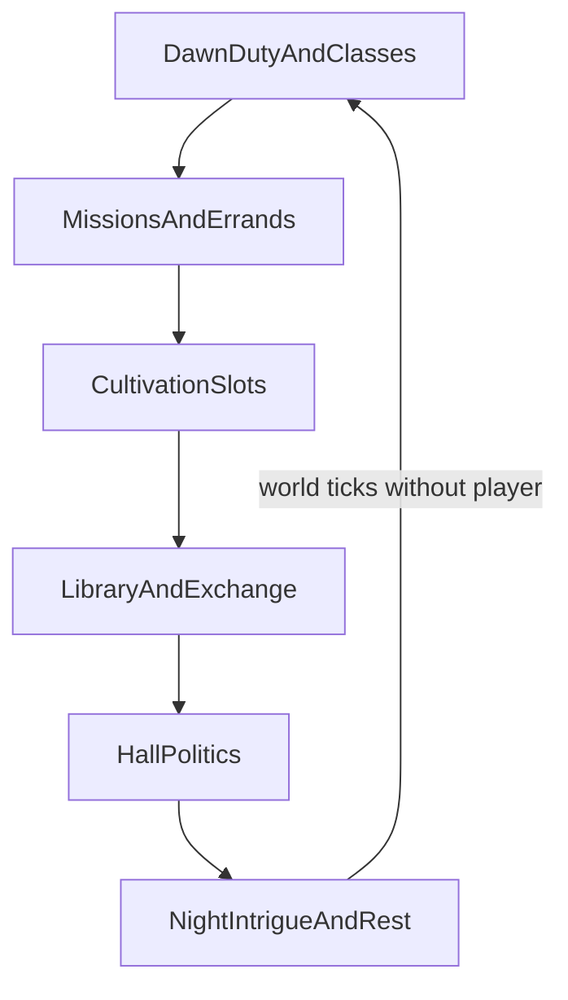

# Sect Life

## Purpose

Designs **daily life inside cultivation sects** so a sect feels like a living institution—disciples, elders, rankings, missions, libraries, classes, tournaments, politics, and relationships—advancing even when the player does nothing.

Faction-level identity remains in [SECTS.md](SECTS.md). This document owns the **internal life loop**.

---

## Confirmed design

- Sects are core setting containers; themes include politics, rivalry, betrayal ([GAME_VISION.md](GAME_VISION.md)).
- The world (and therefore sects) **exists without the player** ([GAME_PRINCIPLES.md](GAME_PRINCIPLES.md)).
- **The sect should feel alive even when the player does nothing**—off-screen schedules, rankings shifts, political moves, mission outcomes, library traffic, tournament prep.
- Engine owns durable membership, ranks, mission results, political facts; AI narrates.
- Recruitment, reputation, and opportunities interact with local reputation ([REPUTATION.md](REPUTATION.md)).
- Members use the **same** cultivation/Dao/profession rules as anyone else—no disciple-only power math.
- **MVP:** full sect life not required; early MVP still needs recruitment / talent exam / first lesson beats for the Boundless event ([BOUNDLESS_FOUNDATION.md](BOUNDLESS_FOUNDATION.md)).
- **Architecture** must support living sect simulation as a modular system ([MVP_SCOPE.md](MVP_SCOPE.md), [SECTS.md](SECTS.md)).

---

## Proposed details

### Daily / seasonal cycle

Even with the player offline or elsewhere, the engine advances: duty rosters, NPC breakthroughs/tribulations, ranking points, elder decrees, resource stockpiles, rumor facts.

### Roles

| Role | Life pattern |
|------|----------------|
| Outer disciples | Chores, basic classes, low missions, probation |
| Inner disciples | Better resources, stricter politics, ranked competition |
| Core / true disciples | Sponsors, heavier expectations, inheritance risk |
| Elders | Teach, judge missions, factional blocs, resource control |
| Peak / ancestral figures | Rare decrees, tournament patronage, Heaven's Will attention magnets |
| Guest / servant / vassal tracks | Parallel ranks without full lineage rights |

### Rankings

**Proposal:** Multi-board rankings (mission merit, combat platform, craft contribution, scholarly exams)—**local to the sect**, not a global hero meter. Boards update from engine events. Affect assignment priority, stipend, and rivalry hooks.

### Missions

- Board-posted and assigned jobs: herb runs, patrols, escort, investigation, craft quotas.
- Outcomes write reputation with issuing hall/elder ([REPUTATION.md](REPUTATION.md)), resources, injuries, history.
- NPC disciples complete missions while the player is away.

### Libraries

- Technique catalog access gated by rank, contribution, and elder favor—not by unique player privilege.
- Reading progresses technique learning and may seed Dao insight ([DAO_SYSTEM.md](DAO_SYSTEM.md), [TECHNIQUES.md](TECHNIQUES.md)).
- Restricted vaults: political prize; theft/betrayal plots.

### Classes

- Scheduled instruction (body/qi theory, weapon forms, profession adjuncts).
- Attendance and performance affect rankings and teacher opinions (local reputation).
- Classes continue with NPC pupils if the player skips.

### Tournaments

- Internal selection platforms and inter-sect meets ([SECTS.md](SECTS.md) / future tournament modules).
- Engine resolves results; rankings and reputations update; AI describes.
- Prep arcs and betting/economy side effects optional long-term.

### Politics and relationships

- Hall factions, succession, resource disputes, betrayal eligibility from goals + grievances.
- Romance/rivalry/mentor bonds as relationship records ([NPCS.md](NPCS.md)).
- Decrees, punishments, expulsion, demotion are permanent facts when applied.

### Player touchpoints (non-unique rules)

- Join tracks use shared membership schema.
- Background may ease introductions ([BACKGROUNDS.md](BACKGROUNDS.md)); never forces “destined sect heir” rules.
- Ignoring sect life has consequences (lost stipend, rival advancement, political drift)—the sect does not freeze.
- Early pipeline (recruitment, talent examination, first cultivation lesson, and the Boundless anomaly/revelation) is a **mandatory shared beat** for every player; background only changes the road to the gate ([BOUNDLESS_FOUNDATION.md](BOUNDLESS_FOUNDATION.md)).

### MVP vs architecture

| MVP | Long-term |
|-----|-----------|
| Stub faction or none | Full duty cycle, boards, library gates |
| No living schedule | Off-screen NPC disciple simulation tiers |
| Static description | Politics, tournaments, betrayal arcs |

---

## Tradeoffs

1. **Full agent sim for every outer disciple vs tiered simulation** — propose tiers (heroes full, cohort aggregates) for scale without killing “alive” feel.  
2. **Player-centric quest hubs vs institution sim** — institution sim is confirmed direction; quests are views into it.  
3. **Many ranking boards vs one ladder** — many boards support craft vs combat paths and reduce single “global good” vibes inside the sect.

---

## Out of scope / non-goals

- Naming every hall of every sect here.
- Freezing the world when the player meditates.
- Player-only lecture skip penalties that NPCs ignore (shared rules).

---

## Unresolved design questions

1. Minimum membership for a “living” tick (how many simulated disciples)?
2. How early can players join, and can they belong to multiple sects?
3. Orthodoxy vs demonic as mechanics or culture tags?
4. Library stealing: technique grant + reputation crash—severity caps?
5. Tournament frequency and Heaven's Will attention?

---

## Expansion notes

- Sect life should emit structured events for AI narration and history.
- Related: [SECTS.md](SECTS.md), [REPUTATION.md](REPUTATION.md), [NPCS.md](NPCS.md), [TECHNIQUES.md](TECHNIQUES.md), [ECONOMY.md](ECONOMY.md), [HEAVENS_WILL.md](HEAVENS_WILL.md).
