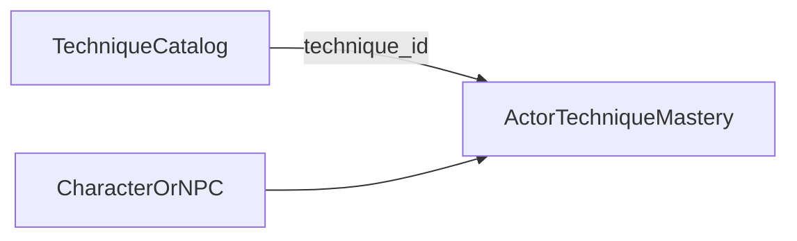

# Techniques

## Purpose

Detailed design of the **permanent technique encyclopedia**: catalog scale, categories, metadata, learning/mastery, effects bounds relative to realms, acquisition, evolution graphs, and AI-assisted creation under engine authority.

**Mechanical effects** from techniques flow through the shared [Modifier Framework](MODIFIER_FRAMEWORK.md). Phase **6c** ships a tiny starter catalog + mastery persistence; cultivation sessions and breakthroughs consume `ModifierSnapshot` only (never technique tables). Phase **6d** adds Event Selection Bias as a third consumer (generic `weight_mult` / `chance_flat` with category metadata).

Complements [CULTIVATION_SYSTEM.md](CULTIVATION_SYSTEM.md) and [REALMS.md](REALMS.md). Profession manuals that are techniques still live here as records; profession *ranks* live in [PROFESSIONS.md](PROFESSIONS.md).

---

## Confirmed design

| Rule | Source |
|------|--------|
| Enormous permanent technique encyclopedia is a **core feature** | GAME_VISION / CULTIVATION_SYSTEM |
| MVP does **not** need thousands of techniques | MVP_SCOPE |
| Architecture must support **thousands** across many categories | MVP_SCOPE / DATABASE |
| Categories include cultivation, body, weapon, movement, soul, formation, alchemy, beast, immortal (non-exhaustive) | CULTIVATION_SYSTEM |
| Metadata includes creator, history, grade, requirements, dao affinity, prerequisites, known users, evolution paths, strengths, weaknesses, lore | CULTIVATION_SYSTEM |
| AI-drafted techniques become permanent only after **engine commit** | AI_BOUNDARIES / AI_SYSTEM |
| Important objects have **history**; persistence is mandatory | GAME_PRINCIPLES |
| Techniques must **not** erase major-realm exponential gaps alone | COMBAT (design compass) |
| Requirements may gate on Body/Qi/Soul/Dao/Foundation Quality as well as realm | CULTIVATION_SYSTEM |
| Same technique learning rules for players and NPCs | GAME_PRINCIPLES |
| Dao affinity ties into the **Dao** cultivation system and dao comprehension trials | CULTIVATION_SYSTEM / TRIBULATIONS |

---

## Proposed design (detailed)

### 1. Two-layer model: Catalog vs Mastery

**Proposal:** Split storage into:

1. **Technique catalog** — world encyclopedia entries (shared or world-unique).  
2. **Actor mastery** — per character/NPC: learned flags, practice progress, equipped slots, personal notes.

This is what allows **thousands of catalog rows** without duplicating full metadata on every learner.

**Tradeoff — embed full text on character vs normalized catalog**

| Approach | Pros | Cons |
|----------|------|------|
| Embed copies on each learner | Simple saves | Explodes disk; history diverges; AI commits duplicate |
| **Normalized catalog + mastery links (proposed)** | Scales; one history; AI commit once | Needs content pack / world DB story ([DATABASE.md](DATABASE.md)) |

### 2. Category system

**Proposal:** `primary_category` (required) + optional `tags[]` for cross-cutting labels.

Confirmed-oriented primary categories (extensible enum/table—not a closed hard-coded combat switch):

| primary_category | Typical use |
|------------------|-------------|
| `cultivation` | Qi circulation, foundation arts |
| `body` | Body tempering manuals |
| `weapon` | Sword, spear, etc. |
| `movement` | Body arts, escape, chase |
| `soul` | Soul / divine sense arts |
| `formation` | Arrays, formations |
| `alchemy` | Pill fire / recipe-linked arts |
| `beast` | Taming, blood contracts |
| `immortal` | High-layer restricted arts |
| `other` | Escape hatch for expansion |

**Tradeoff — single inheritance category vs free tag soup**

| Approach | Pros | Cons |
|----------|------|------|
| **Primary + tags (proposed)** | Filters/UI stay clear; still flexible | Debates over “which primary” |
| Tags only | Maximum flexibility | Hard queries (“all weapon arts”) without discipline |

### 3. Grade model

**Proposal:** Store **numeric `grade_rank`** (integer, sortable) plus optional **display band** string for UI (e.g. mortal / earth / heaven / immortal—**band names not locked**).

- Sorting, filters, and AI validation use `grade_rank`.
- Display bands are presentational groupings of rank ranges.
- Higher grade ≠ automatic win over higher-realm foes; grade modulates within bounds ([REALMS.md](REALMS.md) CPI).

**Tradeoff — named bands only vs numeric rank**

| Approach | Pros | Cons |
|----------|------|------|
| Named bands only | Readable | Painful to insert “between” grades at thousand-tech scale |
| **Numeric rank + display band (proposed)** | Insertible forever; queryable | Needs discipline so ranks stay meaningful |

### 4. Metadata schema (fields may be sparse)

| Field group | Examples | Sparse OK? |
|-------------|----------|------------|
| Identity | `technique_id`, name, primary_category, tags, grade_rank | No for id/name/category/grade |
| Provenance | creator_actor_id or creator_label, history_event_ids | Yes |
| Requirements | min_realm_order, min_stage, path_requirements, dao_affinity, attr gates | Partial |
| Graph | prerequisite_ids[], evolution_to_ids[] | Yes |
| Social | known_user_ids[] (or join table) | Yes |
| Evaluation | strengths[], weaknesses[] (structured tags + text) | Yes |
| Lore | long text | Yes |
| Effects | `effect_bundle_id` or inline effect data | MVP may be minimal |

**Proposal:** Prefer **join tables** for prerequisites, evolutions, and known users rather than huge embedded arrays that are hard to query at scale.

### 5. Effects are data bundles via the Modifier Framework

**Confirmed direction (Phase 6):** Techniques reference an **effect bundle** of allowlisted modifier types. Aggregation, caps, context filtering, and stacking are owned by [MODIFIER_FRAMEWORK.md](MODIFIER_FRAMEWORK.md)—not by per-technique code or private bonus fields.

- New effect *types* are engine version upgrades.
- New techniques mostly reuse existing effect types with parameters.
- Hard rule: **effect magnitude caps** so no technique alone approximates +1 major realm for ordinary cultivators.
- Consumers (cultivation sessions, breakthroughs, event selection bias, later combat) ask for a `ModifierSnapshot`; they do not read technique tables for math.
- Intent / modifier / mutation stay separate: learning a technique is mastery state; using it biases calculations; granting an item or meter change remains a mutation elsewhere.

**Tradeoff — scripted techniques vs parametric effects**

| Approach | Pros | Cons |
|----------|------|------|
| Arbitrary scripts per art | Expressive | Unauditable at thousands; AI-generated danger |
| **Parametric effect bundles + shared Modifier Framework (locked)** | Safe scale; testable; reusable by roots/gear/statuses; AI can fill params into known types | Caps creativity unless new types are added carefully |

### 6. Learning and mastery

**Proposal:**

| Concept | Meaning |
|---------|---------|
| Known / owned | Has access to practice (manual held, taught, etc.) |
| Learning progress | Progress to first usable rank |
| Mastery rank | Discrete practice ranks (e.g. crude → familiar → proficient → perfected)—exact ladder unresolved |
| Equipped / active | Subset usable in combat or daily cultivation |

Learning gates check **engine requirements** (realm order, stage, dao affinity, optional profession skill tags)—never AI opinion.

**Interaction with Boundless Foundation:** Path may improve comprehension efficiency or mastery ceilings (**proposed optional**—unresolved) but must not be the only way to learn ordinary arts.

### 7. Acquisition channels

| Channel | Engine meaning |
|---------|----------------|
| Taught | Teacher NPC/sect grants known flag |
| Found | Item/manual → known |
| Bought / auctioned | Economy transfer |
| Created | Proposal validated → catalog insert → creator known user |
| Evolved | Spend + conditions → unlock evolution target |

All channels write **persistent** catalog/mastery/history facts.

### 8. AI-assisted creation pipeline

**Proposal:**

1. Draft (AI or tools) → candidate record.  
2. Validate: schema, grade caps, effect-type whitelist, realm requirements sane, name collision policy.  
3. Engine assigns `technique_id`, writes catalog (+ history event).  
4. Narration may describe the art **after** commit.

**Tradeoff — free AI creation in play vs gated commit**

| Approach | Pros | Cons |
|----------|------|------|
| Instant play creation | Feels magical | Lore/balance breakage; contradicts engine authority if unchecked |
| **Gated validate→commit (proposed, confirmed intent)** | Permanent safe encyclopedia | Slight friction; needs good validation rules |

Validation strictness tiers (auto-accept low grade vs review immortal-grade) remain unresolved.

### 9. Bounds vs realms (non-negotiable design intent)

Techniques sharpen play **within and near** a cultivator’s band. They must not trivially let an ordinary early-N defeat an ordinary early-(N+1). Boundless Foundation already owns the intentional “compete up one realm” fantasy at high mastery—not random manuals.

Dao-tagged techniques may feed **Dao** axis growth and qualify actors for **dao comprehension trials**; they still use shared rules for every actor.

Requirements should prefer locked realm ids (`body_tempering` … `core_formation`) where early content applies.

### 10. MVP vs long-term architecture

| Concern | MVP implementation (Phase 6c) | Long-term architecture |
|---------|-------------------------------|------------------------|
| Catalog size | Handful of records | Thousands |
| Metadata fill | Mostly empty lore OK | Dense provenance |
| Effects | 1–2 simple modifiers via shared bundles / Modifier Framework | Rich typed bundles; more sources |
| Graph edges | Optional | Prerequisites + evolutions |
| AI commit | Not required | Full proposal pipeline |
| Mastery | Binary known + crude progress OK | Multi-rank mastery |

**Delivery order:** Phase **6a** modifier contract (docs) → **6b** engine stub → **6c** this catalog + mastery + session wiring ([DEVELOPMENT_ROADMAP.md](DEVELOPMENT_ROADMAP.md)).

---

## Tradeoff summary (techniques)

1. **Catalog + mastery** over per-actor copies → thousands of arts.  
2. **Primary category + tags** over tag chaos → usable encyclopedia UI.  
3. **Numeric grade_rank** over named-only grades → insertible ranking.  
4. **Parametric effects via Modifier Framework** over scripts / private technique bonuses → safe AI + testability + reuse by later sources.  
5. **Hard CPI-adjacent caps** over “legendary art wins realms” → preserves exponential cultivation.

---

## Out of scope / non-goals

- Authoring thousands of named techniques here.
- Final mastery ladder names/count.
- Final display band nomenclature.
- Implementation code.

---

## Unresolved design questions

1. Mastery rank count and names?
2. Display band list for grades?
3. Cap numbers for effect multipliers vs one major realm?
4. Max concurrent equipped techniques?
5. Dao affinity model (tags, stats, none in MVP)?
6. World-shared catalog vs per-save invented arts (or both with origin flags)?
7. Auto-accept thresholds for AI drafts by grade_rank?
8. Which categories appear in the MVP handful?
9. Can Boundless Foundation grant unique technique gates without becoming destiny-locked content?

---

## Expansion notes

- Index catalog by `primary_category`, `grade_rank`, `min_realm_order`, tags for encyclopedia queries.
- Sect libraries and auctions reference `technique_id` ([SECTS.md](SECTS.md), [ECONOMY.md](ECONOMY.md)).
- Related: [MODIFIER_FRAMEWORK.md](MODIFIER_FRAMEWORK.md), [DATABASE.md](DATABASE.md), [AI_SYSTEM.md](AI_SYSTEM.md), [COMBAT.md](COMBAT.md), [PROFESSIONS.md](PROFESSIONS.md), [REALMS.md](REALMS.md).
