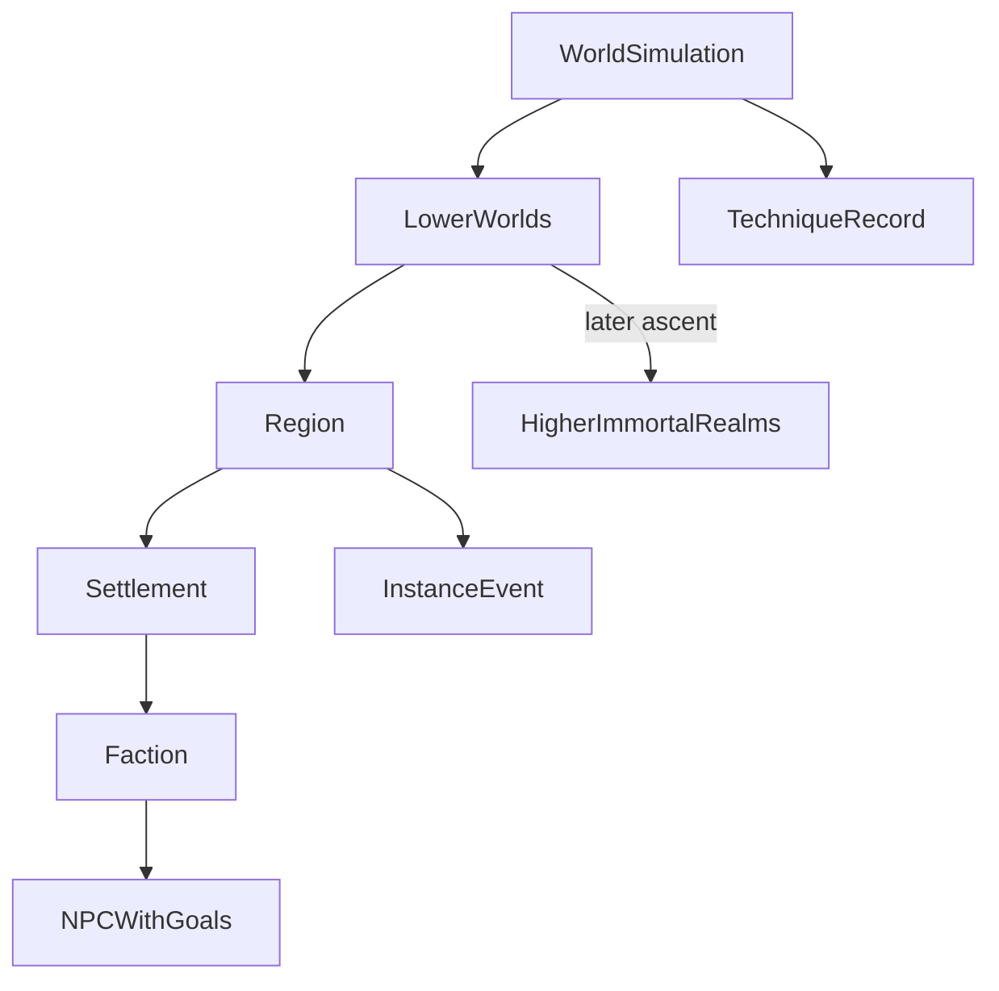

# World Model

## Purpose

Defines the world as a **persistent simulation** with expandable entity types. The world exists independently of the player. This document does not fill a gazetteer; it defines architecture vocabulary and long-term systems the MVP must not contradict.

## Confirmed design

### Simulation identity

- The project is a **persistent cultivation world simulation**, not a player-only stage.
- The **world exists without the player**; important state is **persistent**.
- The engine owns **time** and **permanent facts**.
- AI may narrate places and people; AI must not unilaterally invent permanent mechanical truth into saves.
- **Every NPC has goals**; **every important object has history** (see [GAME_PRINCIPLES.md](GAME_PRINCIPLES.md)).

### Confirmed setting containers

- Sects
- Tournaments
- Secret realms
- Professions
- Lower worlds
- Higher immortal realms

### Long-term systems (architecture must anticipate; not MVP content requirements)

Influence day-one module and data design:

- Living sects
- Kingdoms
- Immortal realms
- Procedural locations
- NPC memories
- World history
- Tournaments
- Dynamic economies
- Auctions
- Caravans
- Professions
- Relationships
- Factions
- Trade routes
- Secret realms
- Ancient inheritances
- Immortal ascension
- Enormous technique encyclopedia as permanent world objects
- Signature tribulations
- Heaven's Will balancing pressure on regions and powerful actors

### MVP vs architecture

| MVP implementation | Long-term architecture |
|--------------------|------------------------|
| Tiny starting context; few actors | Living factions, kingdoms, off-screen sim |
| Minimal clock / persistence | Full world history and NPC memories |
| Few techniques | Thousands of techniques with provenance |
| Stub economy | Dynamic economies, auctions, caravans, trade routes |
| Modular location packs (Phase 5a+) | Pack-local NPCs/events/quests; procedural fill |

**Location packs:** Authored world content is organized as modular packs under `data/world/packs/` and merged into one catalog ([LOCATIONS.md](LOCATIONS.md)). Saves store presence only.

## Proposed details

### Layer vocabulary

| Kind | Role |
|------|------|
| Region | Broad geography |
| Settlement | Town, city, village, market hub |
| Site | Forge, clinic, wilderness camp, auction floor, etc. |
| Faction | Sect, clan, guild, kingdom office, informal network |
| Profession practice | Where work converts to resources / reputation / money / influence / knowledge |
| Technique record | Permanent encyclopedia entry (may be known, lost, restricted) |
| Instance event | Tournament, secret realm, inheritance trial |
| Realm band | Lower worlds → higher immortal realms |
| History record | Durable event / provenance entries |

### Containers as patterns

- **Living sects** — Factions with hierarchy, grounds, recruitment, internal politics, and goals that advance off-screen.
- **Kingdoms** — Larger political layers over settlements and factions.
- **Tournaments** — Instance events with engine-resolved outcomes.
- **Secret realms / ancient inheritances** — Gated instances with risks and durable rewards (including techniques).
- **Economies** — Prices, stock, auctions, caravans, trade routes as data, not flavor text alone.
- **Professions** — Parallel to cultivation; world exposes work sites and contacts.
- **Techniques** — Permanent objects with creator/history/known users; discoverable, teachable, inventable (engine-committed).
- **Immortal realms / ascension** — Vertical endgame bands with access rules as permanent facts.

### Permanent facts vs mutable state

| Permanent facts (examples) | Mutable state (examples) |
|----------------------------|--------------------------|
| Settlement / sect / technique exists | Who holds a title now |
| Inheritance site is real | Whether a portal is open this season |
| Trade route connects A–B | Caravan positions, prices, stock |
| NPC identity and core drives | Current short-term plans, mood, memory entries |

### Professions in the world

Profession sites and contacts convert time into **resources, reputation, money, influence, and knowledge**—never a substitute for cultivation power.

## Out of scope / non-goals

- Filling large maps or naming immortal courts in this pass.
- Implementing full living-world sim in MVP.
- Allowing AI to create permanent locations or techniques without engine commit.

## Unresolved design questions

- MVP starting region size and off-screen sim tick rate?
- How many factions in first playable build?
- Travel model?
- Secret realm time vs outer time?
- Rules for procedural location generation vs authored anchors?
- How inheritance discoveries register into world history?

## Expansion notes

- Add entities by id without changing vocabulary.
- AI describes engine-known entities; new permanent objects require engine persistence.
- Related documents: [GAME_VISION.md](GAME_VISION.md), [MVP_SCOPE.md](MVP_SCOPE.md), [CULTIVATION_SYSTEM.md](CULTIVATION_SYSTEM.md), [AI_BOUNDARIES.md](AI_BOUNDARIES.md), [GAME_PRINCIPLES.md](GAME_PRINCIPLES.md).
